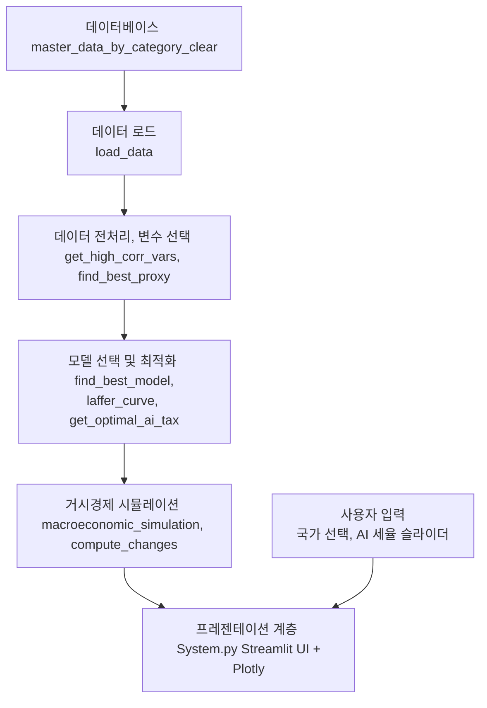

# 📌 AI 기반 세율 최적화 및 경제적 영향 분석 시스템 개발  

## 📖 Abstract  
AI 기술이 노동시장과 기업 운영 방식에 미치는 영향이 커지면서, AI를 활용하는 기업과 그렇지 않은 기업 간의 조세 형평성 문제가 대두되고 있다. 그러나 기존 연구에서는 AI 세율의 최적 수준을 도출하는 구체적인 모델이 제시되지 않았다.  
본 연구에서는 AI 세율 최적화 알고리즘을 개발하고, **AI 세율이 경제 성장과 투자에 미치는 영향을 실증적으로 분석**한다. 이를 위해 **비선형 회귀 분석(OLS), 패널 데이터 분석, 거시경제 시뮬레이션(VAR, VECM)** 등의 기법을 활용하여 AI 세금이 경제에 미치는 영향을 정량적으로 평가하였다.  
또한, 정책적 시사점을 도출할 수 있는 **AI 세금 정책 시뮬레이션 시스템을 개발**하였다. 이를 구현학 위해 **Laffer Curve를 정의하고**하고 GDP와 상관관계가 높은 Proxy데이터로 AI-Tax를 생성하였으며 **VARMAX 모델을 사용해 거시경제 시뮬레이션**을 수행하였다.

- **핵심어(Keywords)**: AI 세금, 머신러닝(ML), 패널 데이터 분석, 비선형 회귀, 거시경제 시뮬레이션, 최적 AI 세율, Laffer Curve


### 🔗 관련 연구 논문  
1. Acemoglu, D., & Restrepo, P. (2020). *Robots and Jobs: Evidence from US Labor Markets*. Journal of Political Economy.  
   - [🔗 논문 링크](https://www.journals.uchicago.edu/doi/10.1086/705716)  
2. Brynjolfsson, E., & McAfee, A. (2014). *The Second Machine Age: Work, Progress, and Prosperity in a Time of Brilliant Technologies*.  
   - [🔗 논문 링크](https://wwnorton.com/books/9780393239355)

### 관련 기술 현황
AI 세율과 관련된 기존 연구는 크게 두 가지 범주
1.	**AI 과세의 필요성과 경제적 영향 분석**
      
      o	기존 연구들은 AI 과세가 노동시장과 기업 경영에 미치는 영향을 이론적으로 분석하는데 초점
      
      o	그러나 구체적인 세율 최적화 알고리즘을 개발한 연구는 부족

2.	**세율 최적화 관련 연구**
      
      o	기존 조세 정책 최적화 연구에서는 경제 성장과 세수 균형을 고려하여 최적 세율을 도출하는 방식이 제안되었다.
   
      o	그러나 AI에 특화된 조세 최적화 모델은 연구가 미흡한 상태이다.

이 두 가지 연구를 결합하여 AI 세율 최적화 모델을 구축하고, 실증적으로 평가하는 점에서 차별화된 접근을 제시


### 😊 How to Install
- ※

1. 가상환경 설치
   ```bash
   python -3.11 -m venv .venv
   ```
   ```bash
   .\.venv\Scripts\activate
   ```
2. requirements.txt
   ```bash
      pip install -r requirements.txt
   ```
3. ./.streamlit/secrets.toml 파일 생성 및 연결 설정
   
   e.g. 
      [connections.ossdb]
      
      dialect = 'mysql'
      
      username = "username"
      
      password = "userpassword"
      
      host = "hostname"
      
      database = "dbname"

4. db연결
※ 작성자의 경우 docker와 dbeaver를 사용함
   ```bash   
   docker-compose up -d
   ```
5. streamlit 실행
   ```bash
   streamlit run home.py
   ```
---

## 📑 목차  
### Ⅰ. Introduction (서론)
1. 연구 배경 및 필요성
2. 연구 목표 및 연구 질문
3. 기존 연구와의 차별점

### Ⅱ. Related Works (관련 연구)
1. AI 도입과 경제 변화 (기존 연구 분석)
2. AI 세금 개념 및 정책 사례
3. AI 세율 최적화 관련 연구

### Ⅲ. Proposed Method (제안하는 방법)
1. AI 세율 최적화 알고리즘 개발 (Laffer Curve 기반 ML 모델)
2. 경제적 영향 분석 방법론
   - 패널 데이터 분석
   - 거시경제 시뮬레이션(VAR, 다변량 VAR, VECM 모델)

### Ⅳ. Experimental Results (실험 결과)
1. AI 세율 최적화 모델 결과
2. 패널 데이터 분석 결과
3. 거시경제 시뮬레이션 결과

### Ⅴ. AI 세금 정책 시뮬레이션 시스템
1. 웹 애플리케이션 기능 개요
2. 시스템 구성도 및 주요 기능
3. AI 세율 적용 시뮬레이션 기능 검토

### Ⅵ. Conclusion (결론 및 정책적 시사점)
1. 연구 요약 및 주요 기여
2. 정책적 함의
3. 연구 한계 및 향후 연구 방향

---

## Ⅰ. Introduction (서론)  

### 1.1 연구 배경 및 필요성  
AI 기술이 빠르게 발전하면서 기업의 생산성과 노동시장 구조가 변화하고 있다. 그러나 기존 조세 체계에서는 AI 도입 기업과 전통적 기업 간 조세 부담의 불균형이 발생할 가능성이 있다. AI 기반 자동화가 진행될수록 기업이 노동세를 적게 부담하면서 정부의 세수 감소가 예상된다. 이에 따라 **AI 세율(AI Tax)을 도입할 필요성이 제기되고 있으나, AI 세율의 최적 수준을 설정하는 연구는 부족**한 실정이다.  

본 연구에서는 AI 세율이 경제 전반에 미치는 영향을 실증 분석하고, 최적 세율을 도출하는 AI 기반 모델을 개발하여 정책적 시사점을 제공하고자 한다.

※ 한국, 중국, 일본, 미국, 영국, 프랑스, 독일 7 개의 국가에 대하여 비교 분석

### 1.2 연구 목표 및 연구 질문  
본 연구는 **AI 세율이 경제 성장과 투자에 미치는 영향을 분석하고, 최적 AI 세율을 도출하는 ML 기반 모델을 개발하는 것**을 목표로 한다.  
이를 위해 다음과 같은 연구 질문을 설정하였다.

- **Q1: AI 세금이 기업 투자와 경제 성장에 미치는 영향은 무엇인가?**  
- **Q2: AI 세율의 최적 수준은 어떻게 설정할 수 있는가?**  
- **Q3: AI 세율을 정책적으로 적용했을 때의 거시경제적 효과는 무엇인가?**

### 1.3 기존 연구와의 차별점
기존 연구들은 AI가 노동시장과 조세 체계에 미치는 영향을 분석하는 데 집중하였으며, AI 세율을 최적화하는 방법론적 접근이 부족했다. 본 연구의 차별점은 다음과 같다.

1. Laffer Curve 기반 AI 세율 최적화 세율 도출
   - Q2.py에서 단일 변수 및 복합 변수 접근법을 통해 최적 세율 도출

2. 다양한 회귀 및 패널 데이터 분석
   - Q1에서 OLS, Ridge/Lasso, 동태적 패널(IV GMM)모형을 활용하여 AI 세금의 영향을 평가함
   - 패널 데이터 분석

3. 거시경제 시뮬레이션
   - Q3에서 단일 VAR, 다변량 VAR, VECM 모형을 활용하여 정책 효과를 정량적으로 분석함.

4. AI 세율 정책 시뮬레이션 시스템 구축
   - 정책 결정자들이 AI 세율 변경 시 경제에 미치는 영향을 실시간으로 확인할 수 있는 시스템 개발

### 1.3 AI 세금 도입의 경제적 논리  
AI 세금 도입을 뒷받침하는 경제적 논리는 다음과 같다.  

1. **조세 중립성 문제 해결**  
   - 기존 조세 체계에서는 기업이 AI를 도입하면 노동 비용 절감 효과를 얻지만, 이로 인해 조세 수입이 감소하는 문제가 발생한다.  
   - 노동세에 의존하는 조세 구조를 AI에도 적용함으로써, 조세 중립성을 유지하고 조세 수입을 보전할 필요가 있다.  

2. **AI가 창출하는 경제적 부가가치의 공정한 분배**  
   - AI 기술은 특정 기업과 산업에 집중적으로 이익을 제공할 가능성이 높다.  
   - AI 세금 도입을 통해 AI 도입에 따른 사회적 비용(예: 일자리 감소)을 보전하고, 재분배 효과를 극대화할 수 있다.  

3. **노동시장 재편 및 실업 문제 완화**  
   - AI 도입으로 인해 기존 노동시장이 축소될 경우, 사회적 비용이 증가할 수 있다.  
   - AI 세금의 일부를 노동자의 재교육 및 사회 안전망 구축에 활용할 수 있다.  

---

## Ⅱ. Related Works (관련 연구)
### 2.1 AI 도입과 경제 변화
- AI 기술 도입이 기업 생산성, 고용, 경제 성장에 미치는 영향 분석 (Autor et al., 2019)
- AI 기술 발전이 노동시장 구조를 변화시키는 과정 (Acemoglu & Restrepo, 2020)
### 2.2 AI 세금 개념 및 정책 사례
- AI 세금 도입을 고려하는 국가 사례: EU, 미국 일부 주, 한국 정책 연구
- 기존 조세 체계와 AI 세율 적용의 차이

---

## Ⅲ. Proposed Method (제안하는 방법)
### 3.1 AI 세율 최적화 알고리즘 개발
- Q2에서 Laffer Curve 기반 비선형 회귀 분석과 다양한 최적화 알고리즘(차분 최적화, Dual Annealing, SHGO)을 활용하여 단일 및 복합 변수 접근으로 최적 AI 세율을 도출하였다.
### 3.2 경제적 영향 분석 방법론
- Q1에서 패널 데이터 분석과 다양한 회귀 모형(OLS, Ridge, Lasso, 동태적 패널 IV GMM)을 통해 AI 세금이 기업 투자와 경제 성장에 미치는 영향을 평가

- Q3에서 거시경제 시뮬레이션(VAR, VECM)를 통해 AI 세율 정책의 장기적 효과를 분석하였다.


### 🔗 3. 사용할 데이터 및 분석 방법  
본 연구는 한국, 미국, 일본, EU 등 주요 국가를 대상으로 데이터를 수집하여 분석할 예정이다.  

## Ⅳ. Experimental Results (실험 결과)
### 4.1 AI 세율 최적화 모델 결과 (Q2):
   - 단일 변수 및 복합 변수 접근법을 통한 최적 AI 세율 도출 결과.

### 4.2 패널 데이터 분석 결과 (Q1):
   - OLS, Ridge/Lasso, 동태적 패널(IV GMM 모형)을 활용한 투자 및 경제 성장 영향 분석

### 4.3 거시경제 시뮬레이션 결과 (Q3):
   - 단일 VAR, 다변량 VAR, VECM 모형을 통한 AI 세율 정책 적용 전후 경제 지표(예: GDP, GERD, 실업률) 변화 분석


## Ⅴ. AI 세금 정책 시뮬레이션 시스템  

### 5.1 웹 애플리케이션 기능 개요  
본 연구에서는 AI 세율 최적화 모델 및 경제 분석 결과를 활용하여 정책 결정자들이 시뮬레이션을 수행할 수 있도록 **Streamlit 웹 애플리케이션**을 개발하였다.

### 5.2-1 시스템 구성도



### 5.2-2 시스템 아키텍처 설명
#### 1 데이터 계층 (Data Layer)
- **데이터베이스 (ossdb)**
  - `master_data_by_category_clear` 테이블에 저장된 경제 데이터를 사용
- **데이터 로드**
  - `load_data()` 함수는 Streamlit의 데이터베이스 연결 기능을 통해 데이터를 불러오며, 국가별 데이터프레임(China, France, USA, Germany, Japan, Korea, UK)으로 분리

#### 2 비즈니스 로직 계층 (Business Logic Layer)
- **데이터 전처리 및 변수 선택**
  - `get_high_corr_vars()` 함수를 이용해 GDP와 높은 상관관계를 가지는 수치형 변수들을 선택.
  - `find_best_proxy()` 함수는 선택된 변수들의 2~3개 조합을 통해 Proxy 후보 변수를 생성.

- **모델 선택 및 최적화**
  - `find_best_model()` 함수는 다항 회귀 및 BIC 기준을 활용해 최적의 Proxy 변수와 회귀 차수를 결정.
  - `laffer_curve()` 함수를 사용해 비선형 관계를 모델링하고, `curve_fit` 및 `differential_evolution`을 통해 최적 AI 세율을 산출하는 `get_optimal_ai_tax()` 함수를 구현.

- **거시경제 시뮬레이션**
  - `macroeconomic_simulation()` 함수는 VARMAX 모델을 사용해 외생 변수(세율)를 포함한 시계열 예측을 수행.
  - `compute_changes()` 함수는 예측된 경제 지표와 실제 값 간의 연간 변화량(차분)을 계산.

#### 3 프레젠테이션 계층 (Presentation Layer)
- **사용자 인터페이스 (UI)**
  - `System.py`는 Streamlit을 사용하여 웹 기반 UI를 제공하며, 사용자가 분석할 국가 선택 및 AI 세율 조정을 위한 슬라이더를 제공.

- **결과 시각화**
  - Plotly를 사용하여 실제 GDP와 예측 GDP(사용자 입력 및 최적 AI 세율 적용 결과)를 시각적으로 비교하는 그래프를 생성.
  - 예측 결과와 전년 대비 변화량을 표 형태로 출력하여 사용자가 쉽게 분석 결과를 확인할 수 있도록 설계.

### 5.2-3 데이터 흐름 및 통합
1. **데이터 로드**  
   - 데이터베이스 → `load_data()` → 국가별 데이터프레임 생성.
2. **전처리 및 변수 선택**  
   - 국가별 데이터 → `get_high_corr_vars()` 및 `find_best_proxy()` → Proxy 후보 생성.
3. **모델 최적화 및 최적 세율 산출**  
   - Proxy 후보 → `find_best_model()` → 최적 모델 선택 → `get_optimal_ai_tax()` → 최적 AI 세율 및 Laffer Curve 파라미터 산출.
4. **거시경제 시뮬레이션**  
   - 최적 세율과 사용자 입력 세율을 각각 반영하여 `macroeconomic_simulation()`을 통해 미래 5년 예측 수행 → `compute_changes()`를 통해 변화량 계산
5. **결과 시각화 및 UI 출력**  
   - 예측 결과 → Plotly 그래프 및 표로 시각화 → Streamlit UI를 통해 사용자에게 출력

### 5.2-4 AI 세율 적용 시뮬레이션 주요 기능
- **사용자가 데이터 확인**  
- **Q1에 관한 분석 내용**  
- **Q2에 관한 분석 내용**  
- **Q3에 관한 분석 내용**
- **국가별 AI 세율 도입 시 GDP 변화율(%) 분석 시뮬레이션** 
- **Streamlit 기반 인터페이스에서 AI 세율 조정 후 경제 변화 확인**  

### 5.2-5 AI 세율 적용 시뮬레이션 기능 검토
- 현재 VARMAX 모델로 시뮬레이션 결과 다음 년도가 가장 높게 나오는 값을 최적 세율로 선정하였다.
- 미래 5년을 예측할 때 각 년도마다 다른 최적 세율을 도출하는 기능을 추가할 필요가 있음
- 과거 데이터가 아닌 데이터가 추가될 경우를 대비하여 코드를 수정할 필요가 존재
- 에러 핸들링 강화, 성능 최적화, 모듈화 및 확장성 강화, 그리고 추가 시나리오 분석 기능 도입 등이 고려 가능함


## Ⅵ. Conclusion (결론 및 정책적 시사점)  
본 연구는 Q1, Q2, Q3의 실증 분석을 통해 다음과 같은 결론을 도출하였다.
### 6.1 경제 성장과 투자에 미치는 영향 
   - AI 세금은 기업 투자(특허 출원 등)와 장기 경제 성장에 유의미한 영향을 미치며, 내생 변수의 효과가 강하게 나타남

### 6.2 최적 AI 세율 도출
   - Laffer Curve 기반 분석을 통해 도출된 최적 세율은 경제 성장 극대화 및 세수 확보 측면에서 중요한 참고자료가 될 수 있음
   
### 6.3 정책적 시사점
   - AI 세율 도입 시 단기 충격뿐 아니라 장기적 경제 구조 변화가 동반되므로, 정책 결정 시 신중한 접근이 필요

### 6.4 연구 한계 및 향후 과제
   - 추가 변수 도입과 외부 요인 반영을 통한 모형 개선이 필요
   - 더 많은 데이터와 실시간 데이터를 기반으로 다양한 시나리오 분석이 필요


## 참고 사항

### 🔗 사용할 데이터 및 출처
- WIPO
- World Bank Open Data
- Unesco

#### 3.1 패널 데이터 분석  
- **WIPO GII(Global Innovation Index)**
- **WorldBank General Goverment Revenue**
- **WorldBank Individuals using the Internet**
- **WorldBank Unemployment Rate**

#### 3.2 Laffer Curve 기반 비선형 회귀 분석, Synthetic Control Method
- **WIPO Patent publications for AI**  
- **다른 데이터**

#### 3.3 거시경제 시뮬레이션(VAR, VECM 모델 활용)  
- **거시경제 데이터**
- **UNESCO GERD as a percentage of GDP**