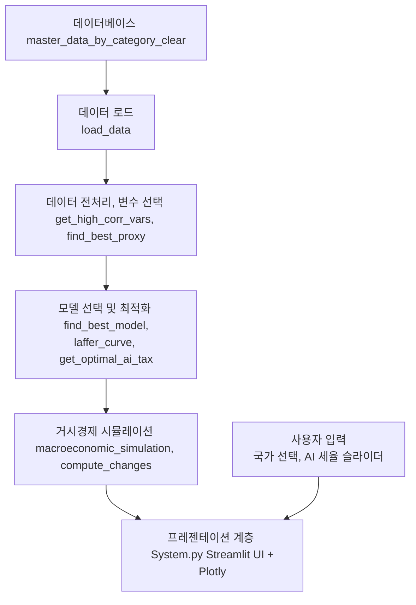

# 📌 AI 세율 도입이 경제에 미치는 영향 분석 및 최적 세율 산출을 위한 정책 시뮬레이션 시스템 개발
#  Analysis of Economic Impacts of AI Tax Introduction and Development of a Policy Simulation System for Optimal Tax Rate Determination
## 📖 Abstract 
AI 도입으로 인한 경제적 변화를 분석하고, 이에 적합한 **최적의 AI 세금을 설계하고 평가**하는 것을 목적으로 한다. AI 기술이 산업 전반에 걸쳐 생산성 향상과 비용 절감 등 긍정적인 효과를 가져오고 있으나, 동시에 일자리 감소와 소득 불평등과 같은 부정적 문제를 야기하고 있어 적절한 정책적 대응이 필요한 시점이다. 본 연구는 AI 도입이 경제 성장과 고용 등에 미치는 영향을 포괄적으로 분석하였다. 이를 위해 본 연구에서는 다양한 경제 지표를 기반으로 **AI 세율 최적화**하고, **Laffer Curve를 활용한 비선형 회귀 분석**과 **글로벌 최적화 알고리즘**을 결합하여 경제 성장을 극대화할 수 있는 최적 세율을 산출하였다. 또한, **패널 데이터 분석과 VAR, VECM 등의 시계열 모형을 활용**하여 AI 세율 도입이 주요 경제 지표에 미치는 영향을 실증적으로 평가하였다. 마지막으로, 이러한 연구 결과를 통합한 **웹 기반 시뮬레이션 시스템을 구축**하여 다양한 세율 시나리오의 경제적 영향을 즉각적으로 평가할 수 있도록 지원하였다. 본 연구의 결과는 AI 세율 정책 설계 시 장기적 경제구조 재조정 효과까지 고려할 필요가 있음을 시사하며, 향후 정책 결정 과정에서 중요한 근거로 활용될 수 있을 것으로 기대된다.

- **핵심어(Keywords)**: AI 기반 시뮬레이션, 글로벌 최적화 알고리즘, 비선형 회귀, 패널 데이터 분석, 거시경제

### 😊 How to Install
- ※

1. 가상환경 설치
   ```bash
   python -3.11 -m venv .venv
   ```
   ```bash
   .\.venv\Scripts\activate
   ```
2. requirements.txt
   ```bash
      pip install -r requirements.txt
   ```
3. ./.streamlit/secrets.toml 파일 생성 및 연결 설정
   
   e.g. 
      [connections.ossdb]
      
      dialect = 'mysql'
      
      username = "username"
      
      password = "userpassword"
      
      host = "hostname"
      
      database = "dbname"

4. db연결
※ 작성자의 경우 docker와 dbeaver를 사용함
   ```bash   
   docker-compose up -d
   ```
5. streamlit 실행
   ```bash
   streamlit run home.py
   ```
---

## 📑 목차  
### Ⅰ. Introduction (서론)

### Ⅱ. Related Works (관련 연구)
1. 관련 사례
2. AI 세금 관련 정책 사례
3. 관련 연구

### Ⅲ. Proposed Method (제안하는 방법)
1. AI 세율 최적화(Laffer Curve 기반)
2. 경제적 영향 분석

### Ⅳ. Experimental Results (실험 결과)
1. AI 세율 최적화 결과(Laffer Curve)
2. 최적화 로직
   2-1 Differential Evolution(차분 진화 알고리즘)
   2-2 Dual Annealing(이중 담금질 알고리즘)
   2-3 SHGO(Simplicial Homology Global Optimization)
3. 패널 데이터 분석 결과
4. 거시경제 시뮬레이션 결과
5. AI 세금 시뮬레이션 시스템

### Ⅴ. Conclusion (결론 및 정책적 시사점)

---

## Ⅰ. Introduction (서론)  
- 최근 수년간 AI의 급격한 발전은 제조, 서비스, 금융 등 산업 전 분야에서 혁신적인 변화를 가져왔다. 

- 글로벌 컨설팅 기업 PwC의 연구에 따르면, **AI 기술은 2030년까지 전 세계 GDP를 최대 14%, 약 15조 7천억 달러 증가시킬 수 있을 것으로 전망**하고 있다. 

- 그러나 **AI 기술의 확대는 단지 긍정적인 영향만을 수반하지는 않는다.** AI 기술 도입이 확대될수록 자동화에 의한 일자리 소멸과 노동 시장의 구조적 변화가 불가피하게 발생하고 있다. 
- 실제로 **OECD는 자동화 기술이 노동시장에 미치는 영향을 분석한 결과, 향후 10~20년 내에 회원국 내 일자리의 약 14%가 완전히 자동화될 가능성이 있다고 경고**했다.
- 이러한 상황에서 AI 기술 도입에 따른 긍정적 경제효과와 부정적 사회경제적 영향을 균형 있게 관리하기 위한 정책적 대응이 요구되고 있다. 
- 일부 국가와 국제기구는 이미 **로봇세(Robot Tax)나 디지털세(Digital Tax) 등의 새로운 형태의 세금 정책을 검토**하고 있으며, 미국과 유럽에서는 빅테크 기업의 초과 이익에 대해 특별한 과세를 부과하는 방안을 논의 중이다.

### (plus) AI 세금 도입의 경제적 논리  
AI 세금 도입을 뒷받침하는 경제적 논리

1. **조세 중립성 문제 해결**  
   - 기존 조세 체계에서는 기업이 AI를 도입하면 노동 비용 절감 효과를 얻지만, 이로 인해 조세 수입이 감소하는 문제가 발생한다.  
   - 노동세에 의존하는 조세 구조를 AI에도 적용함으로써, 조세 중립성을 유지하고 조세 수입을 보전할 필요가 있다.  

2. **AI가 창출하는 경제적 부가가치의 공정한 분배**  
   - AI 기술은 특정 기업과 산업에 집중적으로 이익을 제공할 가능성이 높다.  
   - AI 세금 도입을 통해 AI 도입에 따른 사회적 비용(예: 일자리 감소)을 보전하고, 재분배 효과를 극대화할 수 있다.  

3. **노동시장 재편 및 실업 문제 완화**  
   - AI 도입으로 인해 기존 노동시장이 축소될 경우, 사회적 비용이 증가할 수 있다.  
   - AI 세금의 일부를 노동자의 재교육 및 사회 안전망 구축에 활용할 수 있다. 

### 구체적인 목적
1. AI 도입이 경제성장, 고용 구조, 소득 분배와 같은 주요 경제지표에 구체적으로 어떤 영향을 미치는지를 분석 
2. AI 관련 세금정책의 국내외 사례와 효과성을 살펴보고 이를 통해 향후 한국의 정책적 대응 방향을 모색 
3. Laffer Curve를 활용한 비선형 회귀분석, Differential Evolution과 같은 글로벌 최적화 알고리즘을 결합하여 경제 성장과 세수 증대를 동시에 달성할 수 있는 최적 세율을 도출
4. 웹 기반 AI 세금 정책 시뮬레이션 시스템을 개발

※ 한국, 중국, 일본, 미국, 영국, 프랑스, 독일 7 개의 국가에 대하여 비교 분석

---

## Ⅱ. Related Works (관련 연구)
### 2-1 관련 사례
- 기존 연구들은 주로 AI 도입에 따른 **경제적 영향을 개별적으로 분석**하거나, 특정 세금 정책의 효과를 평가하는 데 초점
- 본 연구는 이러한 접근을 통합하여 AI 도입으로 인한 경제적 변화를 종합적으로 분석하고, 이를 기반으로 최적의 세금 정책을 제안하는 것을 목표
- 또한, 제안된 정책의 효과를 시뮬레이션할 수 있는 시스템을 구축
- AI 기술의 도입은 생산성 향상과 경제 성장에 긍정적인 영향을 미치고 있음 
   e.g. H&R블록의 생성형 AI 환경인 'AI 택스 어시스트'
- 그러나 AI의 도입은 노동 시장의 구조적 변화를 초래하여 고용 불안정과 소득 불평등을 심화시킬 우려도 존재 
- MIT의 연구에 따르면, 로봇에 대한 적절한 세금이 소득 불평등을 줄이기 위한 최적의 정책이 될 수 있다고 제안

### 2-2 AI 세금 관련 정책 사례
- 국세청: 'AI 세금비서' 서비스 
- 또한, AI를 활용하여 세법 연구와 신고 업무를 보다 효율적이고 정확하게 처리할 수 있도록 돕는 AI 에이전트가 개발 중

### 2-3 관련 연구
- 심층 강화학습 기반 조세 및 경제 활동 에이전트 정책 최적화 시뮬레이션 환경을 분석하고 실험한 연구
- AI를 활용하여 탈세 혐의자를 식별하고, 암호화폐 거래를 추적하며, 딥페이크 사기를 탐지하는 등 세무 조사에 AI를 활용하는 연구
- 이러한 관련 연구들을 종합해 볼 때, AI 도입으로 인한 경제적 변화에 대응하기 위한 세금 정책의 필요성이 강조되고 있으며, 이를 위한 다양한 연구와 시도가 이루어지고 있음을 알 수 있음
---

## Ⅲ. Proposed Method (제안하는 방법)
### 3.1 AI 세율 최적화(Laffer Curve 기반)
- GDP와 상관관계가 높은 주요 경제 지표들을 추출 -> GDP와의 높은 연관성을 가진 변수를 선정 -> 이 변수들을 2 ~ 7차 방식으로 조합하여 Proxy(대리 변수)를 생성
- 변수들을 정규화하여(MinMaxScaler), AI 세율과 가장 잘 설명될 수 있는 변수를 선정
- 최적의 Proxy 변수를 선택하기 위해 다항 회귀 모형을 구축(**Bayesian Information Criterion(BIC)**를 기준)
※ 과적합을 방지와 설명력이 높은 최적 모델을 산출하기 위함
- 최종적으로 선택된 Proxy 변수: Laffer Curve을 활용하여 비선형 회귀로 모델링
- 글로벌 최적화 알고리즘인 **Differential Evolution를 사용**하여 GDP를 최대화할 수 있는 최적 AI 세율을 도출

### 3.2 경제적 영향 분석 방법론
- 패널 데이터 모형 및 시계열 예측 모형을 활용
- OLS 회귀 모형, Ridge 및 Lasso 회귀 모형, 동태적 패널 IV GMM 모형

#### 3-2-1 **OLS 회귀 모형**
- 국가별 고정효과를 포함하여 GDP에 영향을 미치는 선형적 관계를 추정

#### 3-2-2 **Ridge/Lasso 회귀 모형**
- 교차검증을 통해 최적의 정규화 계수를 선택하여 변수들의 통계적 유의성을 분석

#### 3-2-3 **동태적 패널 IV GMM 모형**
- **내생성 문제를 해결**하기 위해 과거의 GDP 값을 도구변수로 활용하여 설계
- 기업 투자 및 단기 경제 성장에 미치는 영향을 분석하기 위해 특허 출원 수와 GDP 로그 차분을 활용한 추가적인 분석

#### **시계열 예측 분석**
- **VAR 모형과 VECM 모형을 활용**: GDP, GERD, 실업률 등의 지표가 AI 세율 적용 시 어떻게 변화할지 장기적이고 단기적인 관점에서 분석

## Ⅳ. Experimental Results (실험 결과)
### 4.1 AI 세율 최적화 결과
- 단일 변수와 복합 변수 접근법을 모두 사용하여 **GDP와의 관계를 Laffer Curve 형태로 모델링**
- **단일 변수의 경우 결정계수(R²)가 가장 높은 결과를 선별**
- **복합 변수 접근볍의 경우 여러 가지 조합 가운데 결정계수(R²)가 0.8 이상인 변수 조합을 선별**
- 최적화 과정에서 Differential Evolution과 Dual Annealing 등 다양한 글로벌 최적화 알고리즘을 활용하여 세율을 최적화

- 단일변수 접근 결과, 복합변수 접근 결과사진

#### 4-1-2 Laffer Curve
- **Laffer Curve**: 일반적으로 세율과 세수의 관계를 설명하는 경제학적 모델
   ■ GDP: 세율 변화에 따라 영향을 받는 경제 지표로 최적 세율을 찾기 위한 종속 변수로 활용
   ■ x: AI세율로 표현되는 독립변수로 세율 특성 상 비선형적이고 역 U자 형태 관계를 설정
   ■ a: GDP와 x의 곡률을 결정
   ■ b: 세율 증가가 GDP에 미치는 직접적이고 선형적인 효과
   ■ c: 세율이 0일 때 GDP의 Base level설정
- Laffer Curve


### 4.2 최적화 로직
- Laffer Curve를 이용해 GDP를 최대화할 수 있는 최적 AI 세율을 찾기 위해 아래와 같은 **글로벌 최적화 알고리즘을 활용**
- 세율을 변화시켜 GDP를 최대화하기 위하여 **GDP에 음수를 붙여 최소화 문제로 전환하여 사용**
※ 최소화 문제로 전환: 다양한 최적화 알고리즘을 효율적으로 사용할 수 있음
- 최적화 목적함수(Objective Function)


#### 4.2.1 Differential Evolution(차분 진화 알고리즘)
- 진화적 연산 기반
- 확률적이고 전역 최적해를 찾는데 탁월
- 실수형 연속 공간에서 비선형 함수의 최적화를 위해 주로 사용
- 초기 조건이나 미분 가능성에 대한 엄격한 제한 없이 효과적인 최적화 가능
- 공식


#### 4.2.2 Dual Annealing(이중 담금질 알고리즘)
- Simulated Annealing의 개선된 형태
- 광범위한 탐색을 통해 글로벌 최적해를 찾는 능력을 향상시킨 기법
- 전역적 탐색을 통해 **Local Optimum에 빠지는 현상을 최소화**

#### 4.2.3 SHGO(Simplicial Homology Global Optimization)
- **단순체 동형성 기반의 글로벌 최적화 방법**
- 복잡한 비선형 최적화 문제에서 신뢰할 수 있는 전역적 최적해를 제공하는 데 뛰어난 성능
- **정의된 경계 내에서 함수의 전역 최적점을 찾을 때 유용**
- 안정적, 효율적인 탐색을 제공

### 4.3 패널 데이터 분석 결과
- **OLS 모형을 포함한 다양한 모형**에서 AI 세금 관련 변수들의 경제적 효과 분석
   - **고정효과를 포함한 OLS 모형의 설명력(R²)은 매우 높음**
- **AI 세금이 기업 투자와 경제 성장에 미치는 영향을 분석**
   - 특허 출원 수를 종속변수로 사용한 OLS 모형 결과 세금 관련 변수가 통계적으로 유의한 영향 -> AI 세금 정책이 기업의 연구 개발과 특허 활동에 영향을 줄 수 있음
- **GDP 로그 차분을 종속 변수로 사용한 모형**
   - **단기 성장률 변동에 대한 세금 변수의 영향이 미미**
- **동태적 패널 IV GMM 분석 결과**
   - **과거 GDP 값의 강력한 내생성을 확인** -> **AI 세율 정책이 단기적으로는 GDP 성장률에 미치는 효과가 약하게 나타났으나, 장기적 경제 성장과 구조적 투자에 긍정적인 역할을 할 수 있음을 시사**
   - 기업 투자 및 경제 성장 분석에서는 AI 세율이 기업의 특허 출원 수 등 연구개발 활동에 유의미한 영향 -> AI 세금 정책으로 인한 비용을 줄이기 위한 연구에 영향을 미치며, 단기적인 경제 성장보다는 장기적 경제구조 개선에 더욱 효과적일 수 있음을 암시

[**GDP, Patent의 OLS**]

|                GDP(OLS)           |                Patent(OLS)          |
|:---------------------------------:|:----------------------------------:|
||  |

[**IVGMM 결과**]

|               IV GMM               |              데이터 요약             |
|:----------------------------------:|:-----------------------------------:|
|||

### 4.4 거시경제 시뮬레이션 결과
- **VAR과 VECM 모형을 통해 분석한 결과** AI 세율 정책 적용 시 GDP와 GERD가 감소하고 실업률은 증가
   -> AI 세율 정책 도입 초기에는 기업 투자가 일시적으로 위축되고 노동 시장의 불안정이 발생할 수 있음
- **VECM 모형을 통한 장기적 분석**
   - 경제 시스템이 점차 새로운 균형 상태를 찾으며 장기적으로 안정화될 가능성도 보여줌. 
- 이러한 실험 결과들은 AI 세율 정책이 경제 구조 전반에 중요한 영향을 미칠 수 있으며, 이에 따라 세율 정책의 설계와 시행에 신중하고 정밀한 접근이 필요함을 강조

[**단일 VAR**]
|         GDP 예측              |           실업률 예측                    |            GERD 예측               |
|:----------------------------:|:----------------------------------------:|:----------------------------------:|
|  |    |    |

[**다변량 VAR**]
|              GDP 예측               |                 실업률 예측                    |                 GERD 예측                 |
|:----------------------------------:|:----------------------------------------------:|:----------------------------------------:|
|  |    |    |

[**VECM 예측**]
|             GDP 예측           |               실업률 예측                 |              GERD 예측               |
|:-----------------------------:|:-----------------------------------------:|:-----------------------------------:|
|  |    |    |

- 결과를 좀 더 세부적으로 살펴보면, **AI 세율의 도입이 경제 전반에 미치는 파급 효과는 명확하게 드러남** 
- **단일 변수 VAR 모형을 이용한 분석 결과**
   - GDP와 GERD의 미래 예측치가 AI 세율 도입 이후 하락하는 반면, 실업률은 상승하는 경향
      -> AI 세율의 부과가 기업들의 초기 투자 비용과 연구개발 활동의 축소로 이어지고, 이는 단기적으로 경제 성장에 다소 부정적인 충격을 줄 수 있다는 점을 시사
      -> 특히, 실업률 증가 현상은 AI 기술에 따른 자동화와 더불어 세금으로 인한 기업 비용 증가로 인해 노동시장의 구조 조정이 불가피하게 발생할 가능성을 암시

- **다변량 VAR 분석**
   - GDP, GERD, 실업률 등 여러 경제 지표들이 서로 복합적으로 영향을 미친다는 사실을 확인
   - 예를 들어, GDP와 GERD가 동시에 감소하면 투자 감소로 인해 일자리 창출이 둔화되고, 이는 곧 실업률 증가로 연결되는 구조적인 악순환이 발생할 가능성을 제기
   - **따라서 AI 세율 정책은 단일 지표에만 국한되지 않고 다양한 경제 지표들의 복합적 상호작용을 신중하게 고려하여 설계되어야 한다는 점을 실험 결과를 통해 확인**

- **VECM 모형은 단기 충격뿐만 아니라 장기적인 균형 관계를 고려하여 더욱 심도 있는 분석 결과를 제공** 
   - AI 세율 도입 이후 초기에는 GDP 및 GERD 감소, 실업률 증가라는 부정적 효과가 나타나지만, 시간이 흐르면서 경제 구조가 새로운 균형 상태로 점진적으로 이동하는 양상 
   - 장기적으로 기업과 경제 시스템이 AI 세율에 적응하면서 오히려 더 효율적인 경제 환경을 구축할 가능성이 존재한다는 긍정적 전망도 가능
   - 이러한 결과는 AI 세율 정책의 효과가 단기와 장기 사이에 상당히 상이할 수 있으며, 정책적 효과를 평가할 때에는 장기적인 시각이 필수적임을 강력하게 시사

- AI 세율 정책이 초기에 경제에 부정적인 영향을 미칠 수 있지만, 중장기적으로는 경제 구조의 효율성 향상과 새로운 성장 균형 상태로의 전환 가능성을 동시에 가지고 있음을 제시 
- 따라서 정책 결정자들은 **AI 세율의 단기적 영향뿐만 아니라 장기적 경제구조 조정 효과까지 고려하여 정책을 설계하고 시행해야 할 것**
- 향후 연구에서는 본 연구에서 도출된 결과를 기반으로 더욱 다양한 국가 및 산업별 사례 연구를 확장하여 AI 세율 정책의 일반화 가능성을 높이고, 현실적으로 더욱 유용한 정책 설계를 위한 심도 있는 추가 분석을 진행할 필요
- 또한 실제 거시경제의 경우 여러 복합적인 원인을 가지고 있기에 다양한 변수들과 경제학적인 공식을 기반으로 한 더욱 정교한 모델링과 AI 세율 정책의 단계적 도입 효과를 비교·분석하여 정책 결정 과정에서의 의사결정을 보다 효과적으로 지원할 수 있는 기반을 마련하는 것이 중요할 것으로 판단

### 4.5 AI 세금 시뮬레이션 시스템
- 웹 기반 애플리케이션 형태로 구현되어 있어, 사용자가 별도의 복잡한 분석 작업 없이 간단한 입력만으로도 원하는 경제 지표에 대한 예측과 분석 결과를 즉각적으로 확인할 수 있는 기능을 제공
- 특히 사용자가 특정 세율을 설정하거나 변경할 경우, 이에 따라 경제 지표들이 어떻게 변동할 것인지 시뮬레이션하여 보여줌으로써 실제 정책 결정 과정에서 활용 가능한 직관적인 결과물을 제공
 
- **웹 애플리케이션의 주요 기능** 
   1. **최적 AI 세율을 산출하는 기능**
      - 국가별로 GDP와 높은 상관관계를 보이는 주요 경제 변수들을 선택하고, 이 변수들의 조합을 통해 Proxy를 생성하는 방식으로 동작
      - 이후 Proxy 후보 변수에 대해 다항 회귀 분석을 적용
      - **Bayesian Information Criterion(BIC)을 사용하여 최적의 모델을 선택**한
      - Laffer Curve를 기반으로 **비선형 회귀 모델링을 수행**
      - 최종적으로는 **글로벌 최적화 알고리즘을 사용**하여 경제 성장을 극대화할 수 있는 최적의 AI 세율을 산출하여 사용자에게 제시
   2. **거시경제 시뮬레이션 기능**
      - **VARMAX 모델을 기반으로 GDP, GERD, 실업률 등 주요 경제 지표의 시계열 데이터를 분석하여 미래의 변화를 예측**
      - 사용자는 원하는 AI 세율을 입력하면, 시스템이 이를 외생변수로 포함한 시계열 모델을 학습시켜 향후 5년간의 주요 경제 지표 변화를 예측하고 그 결과를 제공

- 시스템의 구조는 크게 데이터 로드 모듈, 분석 및 모델링 모듈, 최적화 모듈, 그리고 시각화 및 인터페이스 모듈로 구성
   1. **데이터 로드 모듈** 
      - 국가별 경제 지표 데이터를 관리하고 균형 패널 데이터 형태로 변환하여 분석에 적합한 데이터를 제공
   2. **분석 및 모델링 모듈**
      - 상관관계가 높은 변수 선택, Proxy 후보 변수 생성, 최적 다항 회귀 모델 선택 등의 작업 수행
   3. **최적화 모듈**
      - Laffer Curve를 이용한 비선형 회귀 모델링과 글로벌 최적화 알고리즘을 통해 최적 AI 세율을 산출

#### **시스템 아키텍처 설명**
##### **1. 데이터 계층 (Data Layer)**
- **데이터베이스 (ossdb)**
  - `master_data_by_category_clear` 테이블에 저장된 경제 데이터를 사용
- **데이터 로드**
  - `load_data()` 함수는 Streamlit의 데이터베이스 연결 기능을 통해 데이터를 불러오며, 국가별 데이터프레임(China, France, USA, Germany, Japan, Korea, UK)으로 분리

##### **2. 비즈니스 로직 계층 (Business Logic Layer)**
- **데이터 전처리 및 변수 선택**
  - `get_high_corr_vars()` 함수를 이용해 GDP와 높은 상관관계를 가지는 수치형 변수들을 선택.
  - `find_best_proxy()` 함수는 선택된 변수들의 2~3개 조합을 통해 Proxy 후보 변수를 생성.

- **모델 선택 및 최적화**
  - `find_best_model()` 함수는 다항 회귀 및 BIC 기준을 활용해 최적의 Proxy 변수와 회귀 차수를 결정.
  - `laffer_curve()` 함수를 사용해 비선형 관계를 모델링하고, `curve_fit` 및 `differential_evolution`을 통해 최적 AI 세율을 산출하는 `get_optimal_ai_tax()` 함수를 구현.

- **거시경제 시뮬레이션**
  - `macroeconomic_simulation()` 함수는 VARMAX 모델을 사용해 외생 변수(세율)를 포함한 시계열 예측을 수행.
  - `compute_changes()` 함수는 예측된 경제 지표와 실제 값 간의 연간 변화량(차분)을 계산.

##### **3. 프레젠테이션 계층 (Presentation Layer)**
- **사용자 인터페이스 (UI)**
  - `System.py`는 Streamlit을 사용하여 웹 기반 UI를 제공하며, 사용자가 분석할 국가 선택 및 AI 세율 조정을 위한 슬라이더를 제공.

- **결과 시각화**
  - Plotly를 사용하여 실제 GDP와 예측 GDP(사용자 입력 및 최적 AI 세율 적용 결과)를 시각적으로 비교하는 그래프를 생성.
  - 예측 결과와 전년 대비 변화량을 표 형태로 출력하여 사용자가 쉽게 분석 결과를 확인할 수 있도록 설계.

### 데이터 흐름 및 통합
1. **데이터 로드**  
   - 데이터베이스 → `load_data()` → 국가별 데이터프레임 생성.
2. **전처리 및 변수 선택**  
   - 국가별 데이터 → `get_high_corr_vars()` 및 `find_best_proxy()` → Proxy 후보 생성.
3. **모델 최적화 및 최적 세율 산출**  
   - Proxy 후보 → `find_best_model()` → 최적 모델 선택 → `get_optimal_ai_tax()` → 최적 AI 세율 및 Laffer Curve 파라미터 산출.
4. **거시경제 시뮬레이션**  
   - 최적 세율과 사용자 입력 세율을 각각 반영하여 `macroeconomic_simulation()`을 통해 미래 5년 예측 수행 → `compute_changes()`를 통해 변화량 계산
5. **결과 시각화 및 UI 출력**  
   - 예측 결과 → Plotly 그래프 및 표로 시각화 → Streamlit UI를 통해 사용자에게 출력

- 본 시스템은 **사용자 입력에 따른 실시간 예측 결과를 즉각적으로 시각화하여 보여주는 강점**
- 사용자가 AI 세율을 슬라이더 형태로 조정할 수 있게 하여, 다양한 정책 시나리오를 손쉽게 비교하고 분석할 수 있다는 장점
- 예측 결과는 단순히 수치 변화만을 보여주는 것이 아니라, **실제 데이터와 비교하여 연간 변화량을 함께 제시함으로써 사용자가 결과를 더 정확히 이해할 수 있도록 도와준다.** 

#### 개선사항
- 현재 시스템은 실제 **AI 세금이 도입된 이후 발생할 실제 데이터를 추가로 확보하고 지속적으로 모델을 업데이트하는 작업이 요구**
- 또한 데이터 양이 증가하거나 모델 복잡도가 높아질 경우 **성능 최적화 문제**가 발생할 수 있기 때문에, 이를 대비하여 분석 프로세스의 효율성 및 모델의 실행 속도를 개선 
- 향후에는 **민감도 분석 기능 및 AI 세율 정책이 실제 경제에 미친 영향과의 비교 검증 기능** 

- **시스템 구성도**


- 시스템 구현 화면 사진(2)


## Ⅴ. Conclusion (결론 및 정책적 시사점)  
본 연구는 AI 세금의 도입에 따른 경제적 변화를 심층적으로 분석하고, 최적의 AI 세율을 도출하여 이를 정책적으로 활용할 수 있는 방안을 제시하였다. 이를 위해 GDP와의 상관관계를 중심으로 다양한 경제 지표를 활용하여 분석을 실행하고 Laffer Curve를 적용한 비선형 회귀 모형과 Differential Evolution 등의 글로벌 최적화 알고리즘을 통해 GDP 성장을 극대화할 수 있는 최적 AI 세율을 산출하였다.
수행한 패널 데이터 분석 결과, AI 세율 정책은 단기적으로 기업의 연구개발 투자와 경제 성장에 일정 부분 부정적 영향을 미칠 수 있으나, 동태적 패널 IV GMM 분석에서는 AI 세율이 장기적인 경제 성장과 기업의 구조적 투자 활성화에 기여할 가능성이 크다는 점을 밝혀냈다. 또한, VAR과 VECM 모형을 통한 거시경제 시뮬레이션 결과, AI 세율 정책 도입 초기에 GDP와 연구개발 투자의 감소 및 실업률 상승 현상이 나타났으나, 장기적으로는 경제 시스템이 재조정되면서 새로운 균형 상태로 안착할 가능성을 시사하였다. 이는 AI 세율 도입 시 장기적 시각에서 접근하고 신중하게 정책을 수립할 필요성을 강조하는 중요한 결과이다.
정책 결정자들이 AI 세율 도입 효과를 현실적으로 평가하고 활용할 수 있도록 웹 기반 AI 세금 정책 시뮬레이션 시스템을 구축하였다. 이 시스템은 최적 AI 세율 산출 기능과 경제 지표 예측 기능을 제공하며, 사용자가 다양한 세율 시나리오를 직관적으로 비교 분석할 수 있도록 시각화 기능을 탑재하였다. 이 시스템은 향후 AI 세율 정책의 실질적인 도입과 효과 평가 과정에서 실무적으로 유용한 도구가 될 것으로 기대된다.
다만 본 연구의 한계점으로 실제 AI 세율 도입 후 발생할 데이터를 추가 확보하여 모델을 지속적으로 개선할 필요가 있다는 점이다. 앞으로의 연구에서는 더 많은 국가와 산업 사례를 포함한 다양한 맥락에서의 연구를 확장하여 AI 세율 정책의 보편적 적용 가능성을 높이고, 민감도 분석과 실질적인 정책 효과 검증을 수행하여 연구의 신뢰성을 높여나갈 예정이다. 본 연구를 통해 얻어진 통찰과 분석 방법론은 AI 시대의 도래와 함께 발생할 경제적 도전과 기회를 정책적으로 효과적으로 관리하는 데 중요한 지침이 되었으면 한다.


## 참고 사항

### 🔗 사용할 데이터 및 출처
- WIPO
- World Bank Open Data
- Unesco

#### 3.1 패널 데이터 분석  
- **WIPO GII(Global Innovation Index)**
- **WorldBank General Goverment Revenue**
- **WorldBank Individuals using the Internet**
- **WorldBank Unemployment Rate**

#### 3.2 Laffer Curve 기반 비선형 회귀 분석, Synthetic Control Method
- **WIPO Patent publications for AI**  
- **다른 데이터**

#### 3.3 거시경제 시뮬레이션(VAR, VECM 모델 활용)  
- **거시경제 데이터**
- **UNESCO GERD as a percentage of GDP**


### 🔗 References
1. 세금 결산을 지원하는 생성형 AI 환경 구축, "H&R 블록 CIO", CIO, Available at: https://www.cio.com/article/3505007/세금-결산을-지원하는-생성형-ai-환경-구축-hr블록-cio.html
2. "[더존 로드쇼] 우리 회사가 세무조사 받을까? 'AI'가 세무조사 선정값도 예측한다," 세정일보, Available at: https://www.sejungilbo.com/news/articleView.html?idxno=50128
3. Anton Korinek, Joseph E. Stiglitz, "Steering Technological Progress," The Review of Economic Studies, Vol. 90, No. 2, pp. 507-547, 2023.
4. "복잡한 세금 신고 AI 에이전트로 절세... 솔로몬랩스, 시드투자 유치," 유니콘팩토리, Available at: https://www.unicornfactory.co.kr/article/2025020714422898678
5. 허주성, 윤성민, 최승진, "심층 강화학습 기반 조세 및 경제 활동 에이전트 정책 최적화 시뮬레이션 환경 분석 및 실험," 한국지능시스템학회 논문지, Vol.33, No.1, pp.29-39, 2023.