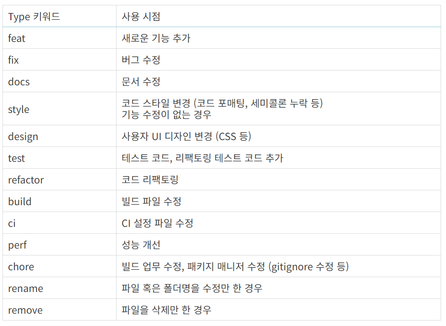

# Automated Cryptocurrency Trading System with XAI and Reinforcement Learning

This project builds a system that performs real-time automated cryptocurrency trading by integrating explainable AI (XAI) with adaptive risk management by applying Hierarchical Reinforcement Learning (HRL) and Multi-Agent Reinforcement Learning (MARL).

이 프로젝트는 계층적 강화학습(HRL), 멀티 에이전트 강화학습(MARL)을 적용하여 적응형 리스크 관리와 더불어 설명 가능한 AI(XAI)를 통합해 실시간으로 암호화폐 자동 매매를 수행하는 시스템을 구축합니다.

---

## 🚀 Features
- **HLC & LLC** (High-Level Controller & Low-Level Controller)
- **Multi-Agency System**
- **Real-time data processing and decision making**
- **Adaptive Risk Management**
- **XAI Integration**

---

## 📌 Contents
1. [System Architecture](#system-architecture)
2. [Main Components](#main-components)
3. [Data Requirements](#data-requirements)
4. [Data Source](#data-source)
5. [How to Install](#how-to-install)
6. [Performance Optimization](#performance-optimization)
7. [Future Improvements](#future-improvements)
8. [License](#license)

---

## 2. Main Components

### 2-1. High-Level Controller (HLC)
- Based on **PPO** algorithm
- Determines overall trading direction (Buy/Sell/Hold)

```python
import torch
import torch.nn as nn

class HLCModel(nn.Module):
    def __init__(self, input_dim, output_dim):
        super(HLCModel, self).__init__()
        self.fc1 = nn.Linear(input_dim, 128)
        self.fc2 = nn.Linear(128, 64)
        self.fc3 = nn.Linear(64, output_dim)

    def forward(self, x):
        x = torch.relu(self.fc1(x))
        x = torch.relu(self.fc2(x))
        return torch.softmax(self.fc3(x), dim=-1)
```

### 2-2. Low-Level Controller (LLC)
- Based on **DDPG** algorithm
- Volume optimization and detailed execution

```python
from stable_baselines3 import DDPG
from stable_baselines3.common.envs import DummyVecEnv
import numpy as np
import gym

class TradingEnv(gym.Env):
    def __init__(self):
        super(TradingEnv, self).__init__()
        self.action_space = gym.spaces.Box(low=0, high=1, shape=(1,), dtype=np.float32)
        self.observation_space = gym.spaces.Box(low=-np.inf, high=np.inf, shape=(10,), dtype=np.float32)

    def reset(self):
        return np.random.rand(10)

    def step(self, action):
        reward = np.random.rand()
        done = False
        return np.random.rand(10), reward, done, {}

env = DummyVecEnv([lambda: TradingEnv()])
llc_model = DDPG("MlpPolicy", env, verbose=1)
```

### 2-3. Multi-Agency System
- Agents that handle multiple time scales

### 2-4. Adaptive Risk Management
- Dynamic risk adjustment based on market volatility

### 2-5. XAI Module
- Interpreting and visualizing the decision-making process

---

## 3. Data Requirements
- **Real-Time Price Data (OHLCV)**
- **Technical Indicators**
- **Market Status Data** (Volatility indicators, volume growth rate, etc.)
- **Trading Results Data**
- **Risk Management Data**

---

## 4. Data Source

### 4-1. Real-Time Price Data (OHLCV)
- CoinMarketCap API
- Binance API (ccxt Library)
- CoinDesk Data API

### 4-2. Technical Indicators
- Direct calculation using **TA-Lib** library

### 4-3. Market Status Data
- **Cboe Volatility Index (VIX)**
- **Financial Modeling Prep API**

### 4-4. Trading Results Data
- To be added in the future

### 4-5. Risk Management Data
#### 4-5-1. Risk Management Algorithm
- Algorithm development
#### 4-5-2. Historical Data
- CoinMarketCap API
- Aberdata OHLCV Endpoint
#### 4-5-3. Exchange Data
- Crypto APIs's Market Data API
```python
import ccxt
import pandas as pd

exchange = ccxt.binance()
symbol = 'BTC/USDT'
timeframe = '1m'  # Can be adjusted to 1h, 3h, 1D, etc.

def fetch_data():
    ohlcv = exchange.fetch_ohlcv(symbol, timeframe)
    df = pd.DataFrame(ohlcv, columns=['timestamp', 'open', 'high', 'low', 'close', 'volume'])
    df['timestamp'] = pd.to_datetime(df['timestamp'], unit='ms')
    return df
```

---

## 5. How to Install

### 5-1. Install Required Libraries
```sh
pip install -r requirements.txt
```

### 5-2. Setting Environment Variables
```sh
export EXCHANGE_API_KEY=your_api_key
export EXCHANGE_SECRET_KEY=your_secret_key
```

---

## 6. Performance Optimization
- **Distributed Processing with Apache Kafka**
- **GPU Utilization (CUDA)**
- **Dynamic Learning Cycle Adjustment**
- **Integrated Risk Management**

---

## 7. Future Improvements
- **Multi-asset support**
- **Enhanced XAI functionality**
- **Real-time dashboard implementation**
- **Backtesting module improvements**

---

### 깃허브 commit message 참고 자료
