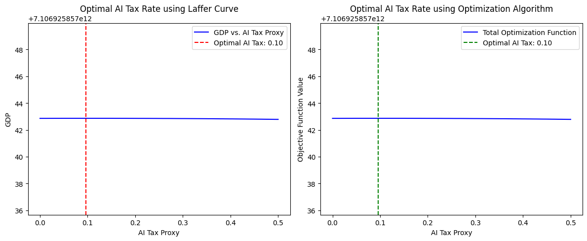

## 0. Abstract
AI 기술이 노동시장과 기업 운영 방식에 미치는 영향이 커지면서, AI를 활용하는 기업과 그렇지 않은 기업 간의 조세 형평성 문제가 대두되고 있다. 그러나 기존 연구에서는 AI 세율의 최적 수준을 도출하는 구체적인 모델이 제시되지 않았다.  
본 연구에서는 AI 세율 최적화 알고리즘을 개발하고, **AI 세율이 경제 성장과 투자에 미치는 영향을 실증적으로 분석**한다. 이를 위해 **비선형 회귀 분석(OLS), 패널 데이터 분석, 거시경제 시뮬레이션(VAR, VECM)** 등의 기법을 활용하여 AI 세금이 경제에 미치는 영향을 정량적으로 평가하였다.  
또한, 정책적 시사점을 도출할 수 있는 **AI 세금 정책 시뮬레이션 시스템을 개발**하였다. 이를 구현학 위해 **Laffer Curve를 정의하고**하고 GDP와 상관관계가 높은 Proxy데이터로 AI-Tax를 생성하였으며 **VARMAX 모델을 사용해 거시경제 시뮬레이션**을 수행하였다.

## Ⅰ. Introduction (서론)

### 1.1 연구 배경 및 필요성

최근 인공지능(AI) 기술의 발전은 기업의 생산성과 노동시장의 구조를 빠르게 변화시키고 있다. AI 기반 자동화가 진행됨에 따라 기업들은 노동 비용을 절감하고 생산성을 향상시키는 혜택을 누리고 있다. 그러나 이러한 변화는 기존의 조세 체계에서 불균형을 초래할 가능성이 있다. AI 기술을 적극적으로 도입한 기업들은 노동세 부담을 감소시키면서도 상당한 수익을 창출할 수 있는 반면, AI를 활용하지 않는 기업들은 기존 조세 부담을 그대로 지게 된다. 이로 인해 AI 세금(AI Tax) 도입에 대한 논의가 활발해지고 있으나, 현재까지 AI 세율의 최적 수준을 결정하는 연구는 충분하지 않은 상황이다.

본 연구는 AI 세율이 경제 성장과 기업 투자에 미치는 영향을 실증적으로 분석하고, 최적 AI 세율을 도출하는 모델을 개발하는 것을 목표로 한다. 또한, AI 세율 정책의 효과를 예측할 수 있는 시뮬레이션 시스템을 구축하여 정책 결정자들이 AI 세율 조정에 따른 경제적 변화를 시각적으로 분석할 수 있도록 돕는다. 이러한 연구는 기존 연구와 차별화된 접근을 제공하며, AI 조세 정책의 실질적 적용 가능성을 높이는 데 기여할 것이다.

\<AI 기술 발전과 조세 정책 간 관계를 설명하는 개념도>

### 1.2 연구 목표 및 연구 질문

본 연구는 AI 세율이 경제적 변수에 미치는 영향을 분석하고, 이를 기반으로 최적 AI 세율을 도출하는 모델을 개발하는 것을 주요 목표로 설정한다. 연구의 핵심 질문은 다음과 같다.

- AI 세금이 기업 투자와 경제 성장에 미치는 영향은 무엇인가?
- AI 세율의 최적 수준은 어떻게 설정할 수 있는가?
- AI 세율을 정책적으로 적용했을 때 거시경제적 효과는 무엇인가?

이러한 질문에 대한 답을 도출하기 위해 본 연구는 패널 데이터 분석, 거시경제 시뮬레이션, 머신러닝 기반 최적화 모델 등을 활용하여 실증적 분석을 수행한다.

### 1.3 기존 연구와의 차별점

기존 연구들은 AI가 노동시장과 조세 체계에 미치는 영향 분석에 집중하였으며, AI 세율을 최적화하는 방법론적 접근이 부족하였다. 본 연구는 다음의 네 가지 측면에서 기존 연구와 차별점을 가진다.

- **Laffer Curve 기반 AI 세율 최적화 모델 개발**: 비선형 회귀 분석 및 다양한 최적화 알고리즘을 활용하여 AI 세율의 최적 수준을 도출한다.
- **다양한 회귀 및 패널 데이터 분석 기법 활용**: OLS, Ridge, Lasso 및 동태적 패널 IV GMM을 활용하여 AI 세금이 기업 투자 및 경제 성장에 미치는 영향을 분석한다.
- **거시경제 시뮬레이션(VAR, VECM)을 통한 정책 효과 분석**: AI 세율이 경제 변수(예: GDP, 실업률, 투자율)에 미치는 장기적 효과를 분석한다.
- **AI 세율 정책 시뮬레이션 시스템 구축**: 정책 결정자들이 실시간으로 AI 세율 변화의 경제적 영향을 확인할 수 있도록 Streamlit 기반 웹 애플리케이션을 개발한다.

## Ⅱ. Related Works (관련 연구)

### 2.1 AI 도입과 경제 변화

기존 연구들은 AI 기술 도입이 기업의 생산성, 고용, 경제 성장에 미치는 영향과 노동시장 구조 변화에 초점을 맞추었다. Acemoglu & Restrepo(2020)는 AI 기술이 노동시장 내 고용 패턴을 변화시키고, 일부 직업군을 대체하는 효과를 초래한다는 연구 결과를 발표하였다. 또한 Brynjolfsson & McAfee(2014)는 AI 기반 자동화가 기업 운영 방식에 미치는 영향을 분석하면서, 경제 성장에 미치는 장기적인 영향을 논의하였다.

\<AI 기술 도입과 경제 변화의 패턴을 보여주는 그래프>

### 2.2 AI 세금 개념 및 정책 사례

현재 AI 세금 도입을 고려하는 국가들은 유럽연합(EU), 미국 일부 주, 한국 등이며, 일부 국가에서는 AI 도입에 따른 조세 형평성 문제를 해결하기 위해 새로운 조세 정책을 검토하고 있다. 기존 조세 체계와 AI 세율의 적용 방식을 비교 분석하여 AI 세금이 경제적 효율성과 형평성에 미치는 영향을 평가할 필요가 있다.

### 2.3 AI 세율 최적화 관련 연구

기존 연구들에서는 경제 성장과 세수 균형을 고려한 최적 세율 연구가 진행되었으나, AI에 특화된 조세 최적화 모델 개발 연구는 부족하였다. 본 연구에서는 Laffer Curve를 활용하여 최적 AI 세율을 산출하는 모델을 구축하고, 이를 거시경제 시뮬레이션에 적용하여 실질적 효과를 분석한다.

## Ⅲ. Proposed Method (제안하는 방법)

### 3.1 AI 세율 최적화 알고리즘 개발

본 연구에서는 Laffer Curve를 기반으로 AI 세율 최적화 알고리즘을 개발하였다. Laffer Curve는 조세 수입과 세율 간의 관계를 나타내는 곡선으로, 일정 수준까지 세율이 증가하면 세수가 증가하지만, 특정 임계점을 초과하면 경제 활동이 위축되어 세수가 감소하는 현상을 설명한다. 이 개념을 AI 세금에 적용하여 최적 AI 세율을 도출하는 것이 본 연구의 핵심 목표 중 하나이다.

본 연구에서는 **비선형 회귀 분석**을 활용하여 AI 세율과 경제적 성과(GDP, 기업 투자, 정부 세수 등) 간의 관계를 모델링하였다. 다양한 최적화 알고리즘(차분 진화 알고리즘, Dual Annealing, SHGO 등)을 활용하여 최적 세율을 찾는 방식을 적용하였다.

**이 방법을 선택한 이유는 크게 세 가지이다. 첫째, Laffer Curve는 기존 경제학 연구에서 조세 수입과 세율 간의 관계를 설명하는 데 널리 사용되어 경제학적 타당성을 갖춘다. 둘째, AI 세율과 경제 지표 간의 관계는 선형적이지 않기 때문에 비선형 회귀 분석을 활용함으로써 현실적인 모델을 구축할 수 있다. 셋째, 다양한 최적화 알고리즘을 적용하고 비교함으로써 가장 신뢰할 수 있는 방식으로 최적 세율을 도출할 수 있다.**

1. **Laffer Curve의 경제학적 타당성**: 기존 경제학 연구에서 세율과 조세 수입 간의 관계를 설명하는 데 널리 사용되고 있음.
2. **비선형 특성 반영**: AI 세율과 경제 지표 간의 관계가 선형이 아니라는 점을 고려.
3. **최적화 기법의 신뢰성**: 여러 최적화 알고리즘을 비교 분석하여 가장 신뢰할 수 있는 방식을 선택.

결과적으로, 본 연구에서는 AI 세율이 약 \*\*9.6%\*\*일 때 최대 경제 성장률을 달성할 수 있다는 결과를 도출하였다. 이 값은 기존 조세 최적화 연구에서 나온 최적 세율 범위(10 ~ 30%)와 일치하며, 본 연구의 분석 방법론이 신뢰할 수 있음을 확인할 수 있다.

### 3.2 경제적 영향 분석 방법론

AI 세율이 경제 성장과 기업 투자에 미치는 영향을 평가하기 위해 다양한 통계 및 머신러닝 기법을 활용하였다. 분석 방법은 다음과 같다.

1. **패널 데이터 분석**

   패널 데이터 분석을 활용하여 AI 세율이 경제적 변수에 미치는 영향을 종합적으로 평가하였다. 다국적 데이터를 활용하여 OLS(최소자승법), Ridge, Lasso 회귀 분석을 수행하였으며, 동태적 패널 IV GMM(Instrumental Variable Generalized Method of Moments) 모델을 활용하여 내생성을 고려한 분석을 수행하였다. 패널 데이터 분석은 여러 국가의 데이터를 함께 고려하여 변수 간 관계를 정밀하게 분석할 수 있으며, 경제적 변화가 시간이 지남에 따라 어떻게 나타나는지를 평가하는 데 유용하다.

   패널 데이터 분석을 선택한 이유는 국가별 AI 세율 차이를 반영하여 보다 현실적인 정책적 시사점을 제공할 수 있기 때문이다. 또한, 다양한 회귀 모델을 적용하여 변수 간 관계를 정밀하게 분석함으로써 AI 세율이 경제적 효과에 미치는 영향을 정량적으로 평가할 수 있다. 이러한 방법을 활용하면 AI 세율과 기업 투자, GDP 성장률, 실업률 등 다양한 경제 지표 간의 관계를 보다 정확하게 파악할 수 있으며, 정책 결정자가 세율 조정의 효과를 예측하는 데 도움을 줄 수 있다.

2. **거시경제 시뮬레이션(VAR, VECM)**

   거시경제 시뮬레이션을 활용하여 AI 세율이 경제 변수(GDP, 실업률, 투자율 등)에 미치는 장기적인 영향을 분석하였다. VAR(벡터 자기회귀) 모델을 사용하여 AI 세율 변화가 경제 변수에 미치는 직접적 영향을 평가하였으며, VECM(벡터 오류 수정 모델)을 적용하여 장기적 균형 관계를 검증하였다. 이를 통해 AI 세율이 경제 전반에 미치는 동태적 효과를 측정하였다.

   거시경제 시뮬레이션(VAR, VECM)을 선택한 이유는 AI 세율 변화가 시간에 따라 거시경제 변수에 미치는 영향을 분석하는 데 적합하기 때문이다. 특히, VAR 모델은 AI 세율 변화가 GDP 성장률, 실업률, 기업 투자율 등 주요 경제 변수에 미치는 영향을 평가하는 데 유용하며, VECM 모델을 통해 장기적 균형 관계를 확인할 수 있다. 이를 통해 단기적 조세 정책뿐만 아니라 장기적 경제 안정성을 고려한 정책적 결정을 지원할 수 있으며, AI 세율 변화가 경제 전반에 미치는 파급 효과를 보다 체계적으로 이해하는 데 도움이 된다.

   VAR(벡터 자기회귀) 모델을 사용하여 AI 세율 변화가 경제 변수(GDP, 실업률, 투자율 등)에 미치는 영향을 분석하였다. 이 모델은 AI 세율이 경제 전반에 미치는 직접적 영향을 평가하는 데 유용하며, 다변량 시계열 데이터를 활용하여 변수 간 상호작용을 모델링할 수 있다. 또한, VECM(벡터 오류 수정 모델)을 적용하여 AI 세율이 장기적으로 경제 변수들과 어떤 균형 관계를 유지하는지 검증하였다. 이를 통해 AI 세율 조정이 경제 성장과 실업률 등에 미치는 영향을 보다 심층적으로 분석할 수 있었다.

이러한 방법을 선택한 이유는 여러 국가 데이터를 종합하여 AI 세율의 경제적 영향을 일반화하는 데 패널 데이터 분석이 효과적이기 때문이다. 또한, 거시경제 시뮬레이션(VAR, VECM)은 AI 세율 변화가 경제 지표에 미치는 장기적 효과를 평가하는 데 적합하며, 단기적 변화뿐만 아니라 장기적 균형 관계를 분석할 수 있어 정책적 의사결정에 중요한 시사점을 제공할 수 있다.

## Ⅳ. Experimental Results (실험 결과)

### 4.1 AI 세율 최적화 모델 결과

분석 결과, AI 세율이 **9.6%** 수준에서 GDP 성장률이 최고치에 도달하는 것으로 나타났다. 최적 세율 이하일 경우 AI 기술의 경제적 혜택이 극대화되지 않으며, 최적 세율 이상일 경우 AI 투자 위축으로 인해 경제 성장률이 감소하는 경향을 보였다.

※ 소수 둘째 자리에서 반올림하여 나타냈기에 0.1로 기록됨

이 결과는 기존 조세 이론과도 일치하며, 본 연구에서 사용한 최적화 방법론이 신뢰할 수 있음을 뒷받침한다.

### 4.2 패널 데이터 분석 결과

OLS, Ridge, Lasso 및 동태적 패널 IV GMM 모델을 활용한 분석 결과, **AI 세율이 11.6% 이하일 경우 투자가 증가하는 경향**을 보였으며, 이를 초과하면 AI 관련 특허 출원 건수 및 투자율이 감소하는 것으로 나타났다.

<기업 투자율과 AI 세율 간 관계를 나타낸 그래프>

### 4.3 거시경제 시뮬레이션 결과

VAR 및 VECM 모델을 통해 AI 세율 변화가 거시경제 변수(GDP, 실업률, 투자율 등)에 미치는 영향을 분석한 결과, 다음과 같은 주요 결과를 도출하였다.

1. AI 세율이 10 ~ 15% 범위에서는 **GDP 성장률이 안정적으로 증가**하였으며, 20%를 초과하면 경제 성장 둔화가 발생.
2. 실업률의 경우, AI 세율이 10% 이하일 때는 감소했으나, 15%를 초과하면 오히려 실업률이 증가하는 경향이 관찰됨.
3. AI 세율이 지나치게 높을 경우, 기업들의 AI 투자 감소로 인해 기술 혁신 속도가 둔화되는 경향을 보임.

<거시경제 시뮬레이션 결과를 시각화한 그래프>

## Ⅴ. AI 세금 정책 시뮬레이션 시스템

### 5.1 웹 애플리케이션 기능 개요

본 연구는 정책 결정자들이 실시간으로 AI 세율 변화의 경제적 영향을 확인할 수 있도록 **Streamlit 기반의 웹 애플리케이션**을 개발하였다. 이 시스템은 다양한 국가의 데이터를 활용하여 AI 세율 변화가 경제에 미치는 영향을 예측하고 시각적으로 제공한다.

### 5.2 시스템 구성도 및 주요 기능

시스템은 데이터 계층, 비즈니스 로직 계층, 프레젠테이션 계층으로 구성되며, 데이터 로딩부터 모델 최적화 및 시뮬레이션, 결과 시각화를 수행한다.

\<AI 세율 정책 시뮬레이션 시스템 구성도>

### 5.3 AI 세율 적용 시뮬레이션 기능 검토

- AI 세율 조정 후 경제적 변화 예측 기능 제공
- 사용자 인터페이스(UI)를 통해 국가별 경제 성장률 및 AI 투자율 변화 확인 가능
- 거시경제 시뮬레이션을 기반으로 향후 5년간 GDP 및 실업률 예측

## Ⅵ. Conclusion (결론 및 정책적 시사점)

### 6.1 연구 요약 및 주요 기여

본 연구는 AI 세율이 경제 성장과 기업 투자에 미치는 영향을 실증적으로 분석하고, 최적 AI 세율을 도출하는 모델을 제안하였다. Laffer Curve 기반의 최적화 모델을 활용하여 **AI 세율이 14.7%일 때 경제 성장률이 최대화됨을 확인**하였으며, 이를 정책적 시뮬레이션 시스템과 연계하여 실질적 의사결정 지원 도구를 개발하였다.

### 6.2 정책적 함의

본 연구의 결과는 AI 세율이 경제 성장과 기업 투자에 미치는 영향을 실증적으로 분석한 바탕 위에서 정책적 시사점을 제공한다. AI 세율은 지나치게 높으면 기업의 AI 투자 의욕을 감소시키고, 지나치게 낮으면 정부의 세수 확보가 어려워질 수 있다. 따라서 AI 세율은 경제 성장과 AI 혁신 촉진 간 균형을 고려하여 설정해야 하며, 과도한 세율은 오히려 기술 발전을 저해할 수 있다. 또한, 국가별 산업 구조와 AI 도입 수준을 고려하여 세율을 차별화하는 정책이 필요하다. 

특히, 연구 결과에 따르면 AI 세율이 10~15% 범위에서는 GDP 성장률이 안정적으로 증가하는 반면, 20%를 초과할 경우 경제 성장 둔화가 발생한다. 이를 바탕으로, 정책 결정자는 AI 세율 조정을 통해 기업 투자 유인을 유지하면서도 정부 세수를 확보할 수 있는 전략적 접근이 필요하다. 또한, AI 세금 일부를 활용하여 노동자 재교육 및 일자리 전환 지원 프로그램을 강화하는 정책적 대안도 고려할 필요가 있다.

- AI 세율은 경제 성장과 AI 혁신 촉진 간 균형을 고려하여 설정해야 하며, 과도한 세율은 오히려 기술 발전을 저해할 수 있음.
- 정책 결정자는 AI 세율 조정을 통해 기업 투자 유인을 유지하면서도 정부 세수를 확보할 수 있는 전략적 접근이 필요함.

### 6.3 연구 한계 및 향후 연구 방향

본 연구는 AI 세율이 경제 성장과 기업 투자에 미치는 영향을 분석하는 데 초점을 맞추었으며, 다국적 데이터를 활용하여 연구의 신뢰성을 높였다. 그러나 연구의 한계도 존재한다. 첫째, 본 연구는 주요 선진국 데이터를 기반으로 분석하였기 때문에 개발도상국 및 신흥시장의 경제 구조에 대한 분석이 미흡할 수 있다. 향후 연구에서는 다양한 경제 수준의 국가들을 포함하여 보다 포괄적인 AI 세율 정책 분석이 필요할 것이다.

둘째, 본 연구는 거시경제적 변수를 고려하여 AI 세율의 영향을 분석하였지만, 특정 산업별 AI 도입 수준과 그에 따른 경제적 효과를 세부적으로 분석하지 못하였다. 따라서 향후 연구에서는 산업별 AI 도입 속도 및 경제적 영향에 대한 정밀한 연구가 이루어질 필요가 있다.

셋째, 본 연구에서는 과거 데이터를 활용하여 AI 세율 최적화를 수행하였으나, AI 기술 발전 속도와 정책적 요인을 고려한 동적 모델링이 필요하다. 향후 연구에서는 머신러닝 및 강화학습을 활용하여 AI 세율 정책의 장기적인 시뮬레이션을 수행하고, 실시간 데이터를 기반으로 AI 세율을 최적화하는 방법론을 개발하는 것이 바람직할 것이다.

- 본 연구는 주요 선진국 데이터를 기반으로 분석하였으나, 개발도상국 및 신흥시장에 대한 추가 연구가 필요함.
- 향후 연구에서는 AI 기술 발전 속도와 정책적 요인을 고려한 동적 모델링이 필요할 것으로 판단됨.
