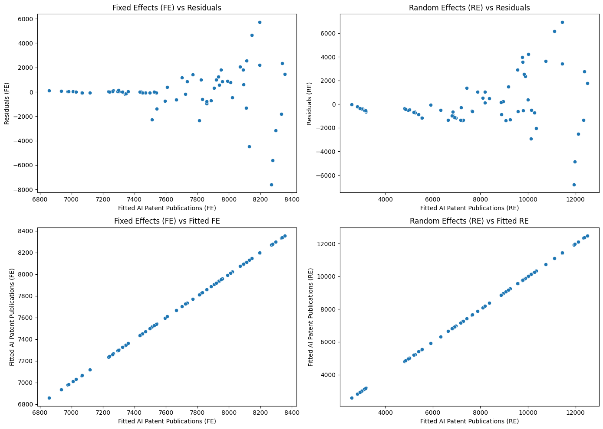

# 🔹Q1: AI 세금이 기업 투자 및 경제 성장에 미치는 영향을 분석하는 코드
- 주어진 데이터를 기반으로 AI 세금의 영향을 분석할 수 있도록 아래와 같은 과정을 수행.

## 🔹 1. 분석 개요
- AI 세금(AI-specific tax) 변수가 존재 X 
- **Proxy Variable(대리 변수)**를 사용하여 분석을 진행.

## ✔️ 변수 선정
### ✅ AI 세금 (Proxy)
- WIPO Tax → AI 관련 법적·조세 환경을 대체 변수로 활용
(WIPO는 지식재산권을 다루며, AI 관련 특허·세금 관련 정책을 포함할 가능성 유)
- **Corporate Tax** → AI 기업을 포함한 전반적인 법인세 수준 반영
### ✅ 기업 투자 (Proxy)
- **Patent Publications** → AI 관련 IT 특허 출원 건수 (AI 투자 대리 지표)
- **GERD (Gross Expenditure on R&D)** → 연구개발 지출
### ✅ 경제 성장 (Proxy)
- **GDP (총생산)**
- **GDP_per_capita_PPP (구매력 평가 GDP)**
## 🔹 2. 분석 목표
### 기업 투자 분석:
- "WIPO Tax"와 "Corporate Tax"가 기업 투자를 (Patent Publications, GERD) 감소시키는지 분석
### 경제 성장 분석:
- AI 관련 세금(WIPO Tax)이 경제 성장(GDP, GDP_per_capita_PPP)에 미치는 영향 확인

## 📌 설명
- 고정 효과 vs 랜덤 효과 패널 모델 비교

### AI 세금(WIPO Tax, Corporate Tax)이 기업 투자 및 경제 성장에 미치는 영향 분석
- Hausman Test를 통해 고정효과 vs 랜덤효과 모델 적합성 평가
- 동태적 패널 모델 추가

### GDP 모델에 1기 시차 변수(GDP Lag) 추가
- Arellano-Bond GMM 적용
- 고정효과 vs. 랜덤효과 모델의 잔차 비교
### 시각화 설명
- 왼쪽: Fixed Effects 모델의 잔차 플롯
- 오른쪽: Random Effects 모델의 잔차 플롯

## 에러 사항
1. **AbsorbingEffectError**
    - 모델에 포함된 효과들이 변수들을 완전히 흡수했을 때 발생
    - 오류 메시지: const, GDP_lag, WIPO Tax, Corporate Tax가 완전히 흡수되었다고 설명

**해결법**
1. 흡수된 변수 제거: drop_absorbed=True를 설정하여, 완전히 흡수된 변수를 자동으로 제거
    - 결과: 여전히 모델에 포함된 변수들이 완전히 흡수되었거나 다중공선성 문제가 발생

2. 상관관계를 확인한 후 상관관계가 높은 변수를 제거 + 차분 사용
    - 다중 공산성 제거
    - GDP_lag와 같은 시계열 데이터를 사용할 때, **차분(Differencing)**을 적용하여 종속 변수와 독립 변수 간의 완전한 선형 관계 제거

---

## 결과 분석 보고서

### 1. Hausman Test 결과

#### 1.1 GDP 모델:
- **테스트 통계량**: 0.5494
- **P-값**: 0.9079

#### 1.2 투자 모델:
- **테스트 통계량**: 2.6251
- **P-값**: 0.4531

#### Hausman 테스트 해석:
- Hausman 테스트: 고정효과 모델(FE)과 랜덤효과 모델(RE) 중 어느 모델을 사용할지 결정하는 데 사용
- 귀무가설: 랜덤효과 모델이 더 적합하다
- 두 모델 모두 P-값이 높으므로, **귀무가설을 기각하지 않음**
- So, **랜덤효과 모델**이 더 적합하다

---

### 2. 상관 행렬

- `GDP_lag`, `WIPO Tax`, `Corporate Tax` 간의 상관 행렬

| **Category**       | **GDP_lag**  | **WIPO Tax** | **Corporate Tax** |
|-------------------|--------------|--------------|-------------------|
| **GDP_lag**       | 1.0000       | -0.5499      | 0.1009            |
| **WIPO Tax**      | -0.5499      | 1.0000       | 0.3690            |
| **Corporate Tax** | 0.1009       | 0.3690       | 1.0000            |

#### 주요 관찰:
- **GDP_lag와 WIPO Tax** 간에 **음의 상관관계 (-0.5499)**가 존재(두 변수가 반대로 움직이는 경향이 있음)
- **WIPO Tax와 Corporate Tax** 간에는 **양의 상관관계 (0.3690)**(두 변수는 함께 증가하는 경향이 있음)
- **GDP_lag와 Corporate Tax** 간에는 **약한 양의 상관관계 (0.1009)**(매우 미미한 관계)

---

### 3. 동적 패널 모델 결과 (GDP)

#### 3.1 모델 요약:
- **종속 변수**: GDP_diff
- **관측치 수**: 63
- **R-squared (Overall)**: -0.4272
- **R-squared (Within)**: 0.0458
- **로그 가능도 (Log-likelihood)**: -1784.2
- **F-통계량**: 1.2970
- **P-값**: 0.2817

#### 추가 정보:
- **F-통계량 (Robust)**: 2.3738
- **P-값 (Robust)**: 0.1028

---

### 4. 계수 추정 결과

| **파라미터**       | **표준 오차**  | **t-통계량**  | **P-값**  | **하한 CI**  | **상한 CI**  |
|------------------|---------------|--------------|----------|--------------|--------------|
| **const**         | 1.72e+11      | 1.092e+12    | 0.1575   | -2.018e+12   | 2.362e+12    |
| **WIPO Tax**      | 3.046e+10     | 3.929e+10    | 0.7753   | -4.831e+10   | 1.092e+11    |
| **Corporate Tax** | -3.041e+10    | 1.416e+10    | -2.1480  | -5.879e+10   | -2.026e+09   |
    ※ GPT를 통해 표 정리

#### F-test for Poolability:
- **F-통계량**: 4.5768
- **P-값**: 0.0008

---

### 5. 시각화 결과

#### 5.1 4개의 그래프 시각화

- **왼쪽 상단**: 고정효과(FE) 예측값 vs 잔차
- **오른쪽 상단**: 랜덤효과(RE) 예측값 vs 잔차
- **왼쪽 하단**: 고정효과(FE) 예측값 vs 고정효과(FE)
- **오른쪽 하단**: 랜덤효과(RE) 예측값 vs 랜덤효과(RE)

#### 5.2 그래프 설명:

- **고정효과(FE) vs 잔차**:
  - 예측된 고정효과(FE) 값과 잔차 간의 관계
  - 고정효과 모델의 예측 성능
  
- **랜덤효과(RE) vs 잔차**:
  - 예측된 랜덤효과(RE) 값과 잔차 간의 관계
  - 랜덤효과 모델이 어떻게 예측되었는지 평가

- **고정효과(FE) vs 예측된 고정효과(FE)**:
  - 고정효과 모델의 예측값과 실제 고정효과 값 간의 관계

- **랜덤효과(RE) vs 예측된 랜덤효과(RE)**:
  - 랜덤효과 모델의 예측값과 실제 랜덤효과 값 간의 관계

---

### 6. 결론

- **Hausman 테스트**의 결과, **GDP 모델**과 **투자 모델** 모두 **랜덤효과 모델**이 적합.
- P-값이 매우 높아 귀무가설을 기각할 수 없으므로 랜덤효과 모델이 두 모델에 적합하다고 판단.
  
- **상관 행렬**에서는 `GDP_lag`와 `WIPO Tax` 간의 음의 상관관계, `WIPO Tax`와 `Corporate Tax` 간의 양의 상관관계
  
- **동적 패널 모델**의 **R-squared 값**이 낮아 모델의 설명력이 제한적임을 나타내며, `Corporate Tax`는 중요한 변수로 평가
  
- **계수 추정 결과**에서 `Corporate Tax`의 P-값이 유의미(0.0362), 이 변수는 모델에서 중요한 역할을 한다고 할 수 있음

