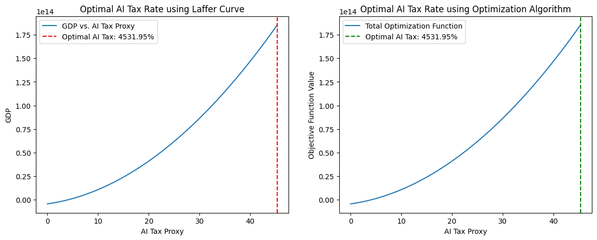

# 🔹 Q2: "AI 세율의 최적 수준은 어떻게 설정할 수 있는가?"에 대한 분석 방법

## 1. 분석 개요
- 현재 AI 세율 데이터가 존재하지 않으므로 대체 변수를 활용하여 AI 세율이 기업 투자 및 경제 성장에 미치는 영향을 분석해야 한다.
- 4_Q1 Report.md에서 AI 관련 세금(WIPO Tax, Corporate Tax)과 기업 투자 및 경제 성장 간의 관계를 분석한 내용을 반영하여, AI 세율의 최적 수준을 설정하는 분석을 진행

## 2. AI 세율 최적 수준 설정을 위한 분석 방법

### 1. GDP와 AI 세율 간의 관계 분석 (비선형 회귀: OLS 회귀 분석)
  - AI 세율(AI Tax Proxy)과 GDP 간의 관계를 회귀 분석
  - 비선형 모델을 사용하여 최적 세율을 찾음
  - Laffer Curve를 활용한 최적 AI 세율 계산

### 2. 조세 수입과 경제 성장 간의 관계를 나타내는 Laffer Curve를 적용
  - GDP 극대화 포인트를 찾기 위해 2차 함수 모델을 피팅

### 3. Elasticity Analysis (탄력성 분석) 및 최적화 알고리즘 적용
  - AI 세율 변화에 따른 기업 투자, AI 특허, 경제 성장률 감소 비율을 확인
  - AI 세율을 조정하여 기업 투자 및 경제 성장을 극대화하는 최적 세율(𝜏)을 찾기 위한 최적화 알고리즘 적용

## 3️. 분석 결과 해석

### Laffer Curve 최적화 결과

## 정책적 시사점

## 4. 결론 및 최적 AI 세율 설정

### Trouble Shooting
#### 1. 최적 세율이 0%로 나오는 문제
  - 다항 회귀 모델 계수 (β1, β2) 값이 비정상적으로 작거나 부적절하게 설정
    - x1(1차항)의 P-value: 0.537 (유의하지 않음)
    - x2(2차항)의 P-value: 0.750 (유의하지 않음)
    - 회귀 모델의 R² 값: 0.110 (모델 적합도가 낮음)
  - 다중공선성 문제 (Multicollinearity)
    - condition number = 2.48e+04 로 큰 편
  - 세율과 GDP의 관계가 단순 2차 함수로 설명되지 않을 가능성 존재
  -  고차항(3차항 이상)이 필요할 것으로 보임

#### 1. 해결법
1. 다항 회귀 차수를 증가 (Quadratic → Cubic)
    - 2차 함수(Quadratic)에서 3차 함수(Cubic)로 확장
    
      y = β0 + β1*x + β2*x² + β3*x³

2. 데이터 표준화 (Standardization)
    - AI 세율 변수와 GDP의 스케일 차이가 큼
    - 이를 해결하기 위해 Min-Max Scaling 또는 Standard Scaling을 적용

3. 다중공선성 제거
    - VIF(Variance Inflation Factor)를 이용하여 다중공선성이 높은 변수를 제거
    - Corporate Tax나 WIPO Tax 중 하나만 선택하여 AI Tax Proxy를 구성
4. 최적화 함수 변경
    - 현재 minimize()가 특정 범위 내에서만 최적화를 수행하므로, 다양한 초기값 탐색을 도입

#### 2. 최적 세율이 4531.95%로 너무 크게 나옴
1. 회귀 모델의 비현실적인 계수(beta1, beta2)
    - 다항식 형태의 Laffer Curve 모델에서 beta1과 beta2가 GDP에 대한 AI 세율의 영향력을 과대평가했을 가능성이 있음.
    - 이는 최적 AI 세율이 지나치게 높은 값으로 도출되는 원인

2. 회귀 모델의 과적합 문제
    - GDP를 AI 세율(AI_Tax_Proxy)의 2차 함수로 모델링했을 때, 데이터 패턴을 제대로 반영하지 못하고 곡선이 지나치게 기울어지는 문제가 발생할 수 있음.
  
3. 최적화 문제에서 제약 조건 미설정
    - scipy.optimize.minimize 함수에서 AI 세율의 합리적인 범위를 설정하지 않음.
    - 현실적인 최적 AI 세율이 0~50% 이내여야 하지만, 최적화 과정에서 더 높은 값을 찾는 문제가 발생.

#### 2. 해결법

1. 데이터의 스케일을 조정: AI 세율을 0~1 범위로 정규화
    - AI_Tax_Proxy를 GDP 대비 비율로 변환하여 모델이 과적합되지 않도록 조정.

2. 비현실적인 계수(beta1, beta2)를 줄이는 정규화 기법 적용
    - OLS 회귀 대신 Ridge Regression(릿지 회귀)을 적용하여 과적합을 방지.

3. 최적화 문제에서 AI 세율의 합리적인 범위를 설정 (0~50%)
    - bounds=[(0, 0.5)]와 같은 범위를 추가.

#### 3. 최적 세율을 현실적으로 설정한 값의 최댓값으로만 나옴
1. 회귀 계수의 비정상적인 크기

    - 회귀 계수(β0, β1, β2, β3)가 비정상적으로 크거나 부호가 이상함.
    - 특히 β1이 양수, β2가 음수, β3가 양수로 나타나서 정상적인 포물선형 (Laffer Curve) 형태를 갖추지 못할 가능성이 높음.

2. 다중공선성 (VIF 값이 비정상적으로 큼)
    - AI 세율의 다항식 항(AI_Tax_Proxy, AI_Tax_Proxy², AI_Tax_Proxy³)의 VIF 값이 15000~60000 수준으로 매우 높음.
    - 다중공선성 문제를 야기하여 회귀 계수 추정값이 불안정

3. Laffer Curve 분석에서 AI Tax Proxy 증가에 따라 GDP가 선형적으로 증가하는 문제

    - Laffer Curve에서는 최적의 세율에서 GDP가 최대가 되어야 하지만, 현재 그래프에서는 AI 세율이 증가할수록 GDP도 계속 증가
    - 최적 세율이 0.5(50%)로 설정되는 이유는 단순히 모델이 최댓값을 가장 큰 범위 끝에서 찾기 때문으로 판단

#### 3번 해결법
1. 다중공선성 완화
    - 다항식 항을 정규화(normalization) 혹은 중심화(centering)를 수행
    - AI_Tax_Proxy의 평균을 0으로 맞추고 표준편차로 나누어 정규화하면 다중공선성을 줄이기

2. 적절한 다항식 차수 선택
    - 현재는 3차 다항식을 사용했지만, BIC/AIC를 비교하여 최적 차수를 자동 선택하는 방식으로 수정

3. Laffer Curve 모형 재설정
    - 현재 단순 OLS 회귀를 사용했지만, 비선형 최적화 (e.g., scipy.optimize.curve_fit)를 활용하여 직접 최적점을 찾도록 수정.
    - GDP가 AI 세율과 U자형 관계를 갖도록 제약 조건 추가.

4. 최적화 알고리즘 개선
    - 현재는 세율 범위를 0~50%로 설정하고 최댓값을 찾지만,
    - 최적화 범위를 조정하거나 초기값을 변경하여 비정상적인 최대값(50%)이 나오지 않도록 할 필요 있음