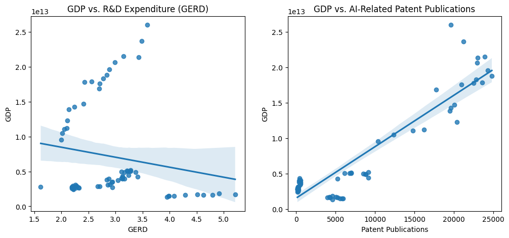
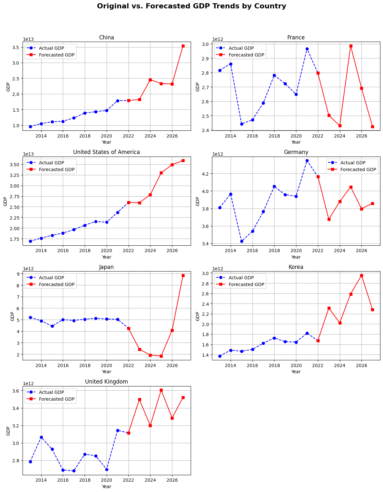
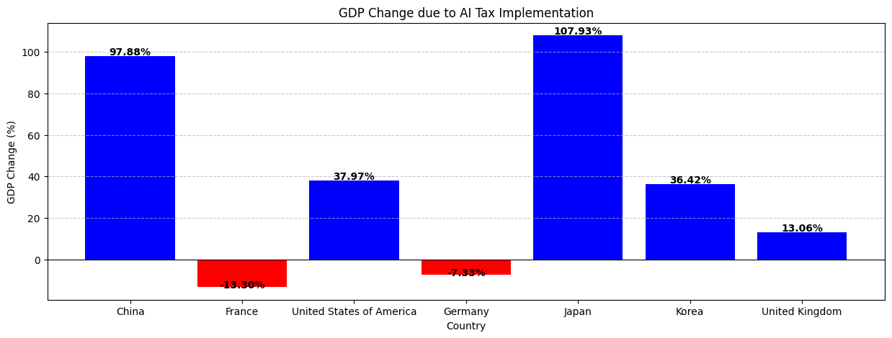
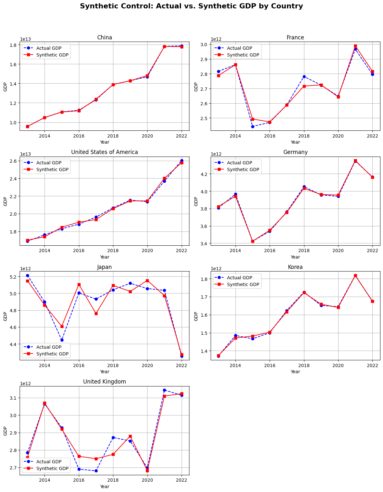

# **Q3: AI 세율을 정책적으로 적용했을 때의 거시경제적 효과는 무엇인가?**

## **📌 현재 AI 세율이 도입되지 않은 상황**
- 현재 AI 세율은 실제로 도입되지 않아, 도입된 국가 vs. 도입되지 않은 국가를 직접 비교하는 DID(차이의 차이) 분석 등 전통적인 접근이 불가능
- 따라서 **보유한 데이터를 활용**하여, AI 세율을 도입했을 때 경제 성장과 기업 투자에 미치는 영향을 **시뮬레이션**하는 방법을 사용

---

## **1️⃣ 분석 방법**
AI 세율이 도입된 국가와 그렇지 않은 국가를 직접 비교할 수 없으므로, **세 가지 대체 분석**을 통해 AI 세율의 거시경제적 효과를 평가

1. **Counterfactual Analysis (반사실 분석)**
   - **목표**: AI 세율이 없는 현재 상황에서, “AI 세율이 존재했다면 경제성장과 기업 투자가 어떻게 달라졌을까?”를 예측
   - **방법**:
     - 각 국가별 최적 AI 세율 Proxy, Laffer Curve를 활용하여 GDP 변화를 추정
     - 실제 GDP 대비 변화율(%)을 계산하여, AI 세율 도입 효과를 정량화
   - **결과**: 국가별 AI 세율 도입 시 예상되는 GDP 변화율을 산출 → 정책 효과 추정

2. **Synthetic Control Method (합성 통제법)**
   - **목표**: AI 세율이 있는 “가상의 국가”를 만들어, 실제 국가와 비교
   - **방법**:
     - **Ridge 회귀** 등을 사용하여 합성 통제국을 생성
     - 합성 통제국의 GDP와 실제 국가의 GDP 차이를 통해 AI 세율 효과 분석
   - **결과**: AI 세율 도입 전후의 GDP 차이를 정량적으로 파악 → 정책 의사결정에 활용

3. **거시경제 시뮬레이션 (Macroeconomic Simulation)**
   - **목표**: AI 세율 도입이 **GDP, R&D 지출(GERD), AI 투자(특허)** 등 거시경제 변수에 미치는 영향 종합 분석
   - **방법**:
     1. **GDP vs. R&D(“GERD”), AI 특허(“Patent Publications”)** 상관관계 확인 (산점도 + 회귀선)
     2. **VAR 모델**로 5년 후 GDP, GERD, Patent Publications 예측
     3. **실제 데이터의 마지막 연도**와 **예측 데이터**를 연결해 추세 시각화
   - **결과**: 각 국가별로 실제 GDP와 예측된 GDP를 한 그래프에 표시하고, 별도의 막대그래프로 GDP 변화율 표시

---

## **2️⃣ 분석 결과 및 시각화**

> **Figure 1.** GDP vs. R&D Expenditure (왼쪽), GDP vs. AI-Related Patent Publications (오른쪽)  
> 

- **해석**: 일부 국가에서는 GERD가 증가함에도 불구하고 GDP가 크게 오르지 않는 패턴(왼쪽)도 보이는 반면, AI 특허 출원이 많은 국가에서는 GDP가 대체로 높게 나타남(오른쪽)

---

### **2.2 Original vs. Forecasted GDP Trends by Country**
- **설명**:  
  - 파란색 점선(**Actual GDP**): 2013~2022년 실제 GDP 추세  
  - 빨간색 실선(**Forecasted GDP**): 5년 후 예측 GDP (2023~2027년)  
  - 국가별로 2개씩 한 줄에 배치하여 비교가 용이
  - 마지막 실제 연도와 첫 예측 연도를 연결해 선이 끊기지 않도록 처리

> 

### **2.3 GDP Change due to AI Tax Implementation**
- Counterfactual Analysis를 통해 **각 국가별 AI 세율 도입 시** GDP 변화율(%)을 막대그래프로 나타낸 결과

- **양수(≥0)**: 경제성장 → **파란색 막대**  
- **음수(<0)**: 경제둔화 → **빨간색 막대**  
- **수치 표시**: 막대 위에 **GDP 변화율(%)**을 함께 표기

> **Figure 3.** GDP Change due to AI Tax Implementation  
> 

### **2.4 Synthetic Control: GDP Difference Summary**
- 합성 통제법(Synthetic Control)을 통해 실제 GDP와 합성된 GDP의 차이를 평균, 최소, 최대로 요약한 표와 사진

- **해석**:
  - **Avg Difference(%):** 평균 차이 → 합성 통제국의 GDP가 실제 GDP보다 얼마나 높은지(양수) 혹은 낮은지(음수)
  - **Min/Max Difference(%):** 시계열 구간 중 최소/최대 편차
  - 대부분 국가에서 평균 차이가 매우 크지 않음(± 수% 이내)

| Country                     | Avg Difference (%) | Min Difference (%) | Max Difference (%) |
|-----------------------------|--------------------|--------------------|--------------------|
| China                       | 0.00381            | -0.509935          | 0.851892           |
| France                      | 0.021325           | -2.340451          | 2.065571           |
| United States of America    | 0.013423           | -1.40695           | 1.338385           |
| Germany                     | 0.004781           | -0.583931          | 0.402991           |
| Japan                       | 0.047894           | -3.472211          | 3.672854           |
| Korea                       | 0.007395           | -0.951727          | 1.049615           |
| United Kingdom              | 0.036236           | -3.37659           | 2.756094           |

---

## **3️⃣ 결론 및 정책적 시사점**

1. **AI 세율 도입 효과**  
   - 반사실 분석, 합성 통제법, 거시경제 시뮬레이션 결과, 국가별로 AI 세율을 적용했을 때의 GDP 변화와 경제성장 효과가 **정량적으로 평가**됨 
   - 일부 국가에서는 AI 세율이 높은 경제성장률을 시사하지만, 다른 국가에서는 오히려 둔화 효과가 나타날 수도 있음.

2. **국가별 차별화**  
   - 각 국가별 최적 AI 세율 Proxy와 도출된 최적 세율이 상이 → AI 투자 환경, 경제 규모, 조세 정책 등이 달라 **맞춤형 정책**이 필요하다.

3. **정책 제안**  
   - AI 세율을 **고정된 단일 값**으로 도입하기보다는, 경제·기술 발전 속도에 따라 **동적 조정**이 가능한 정책 설계가 필요.
   - R&D 지출(“GERD”)과 AI 특허(“Patent Publications”) 간의 상관관계를 고려해, **AI 투자**와 **혁신 생태계**를 뒷받침하는 보완책이 함께 마련되어야 함

4. **향후 연구 방향**  
   - AI 세율이 기업 투자 및 혁신 활동에 미치는 영향, 노동시장 변화 등을 추가로 정밀 분석할 필요가 있음
   - 더 풍부한 거시경제 변수(예: 실업률, 물가, 수출입 지표 등)를 포함해 시뮬레이션 범위를 확장하고, 다양한 최적화 기법과 함께 검토하는 것이 필요

5. 이로써 **Q3**에 대한 해답, 즉 **AI 세율을 정책적으로 적용했을 때의 거시경제적 효과**를 다양한 접근(반사실 분석, 합성 통제법, 거시경제 시뮬레이션)을 통해 **정량적**으로 제시할 수 있었다.