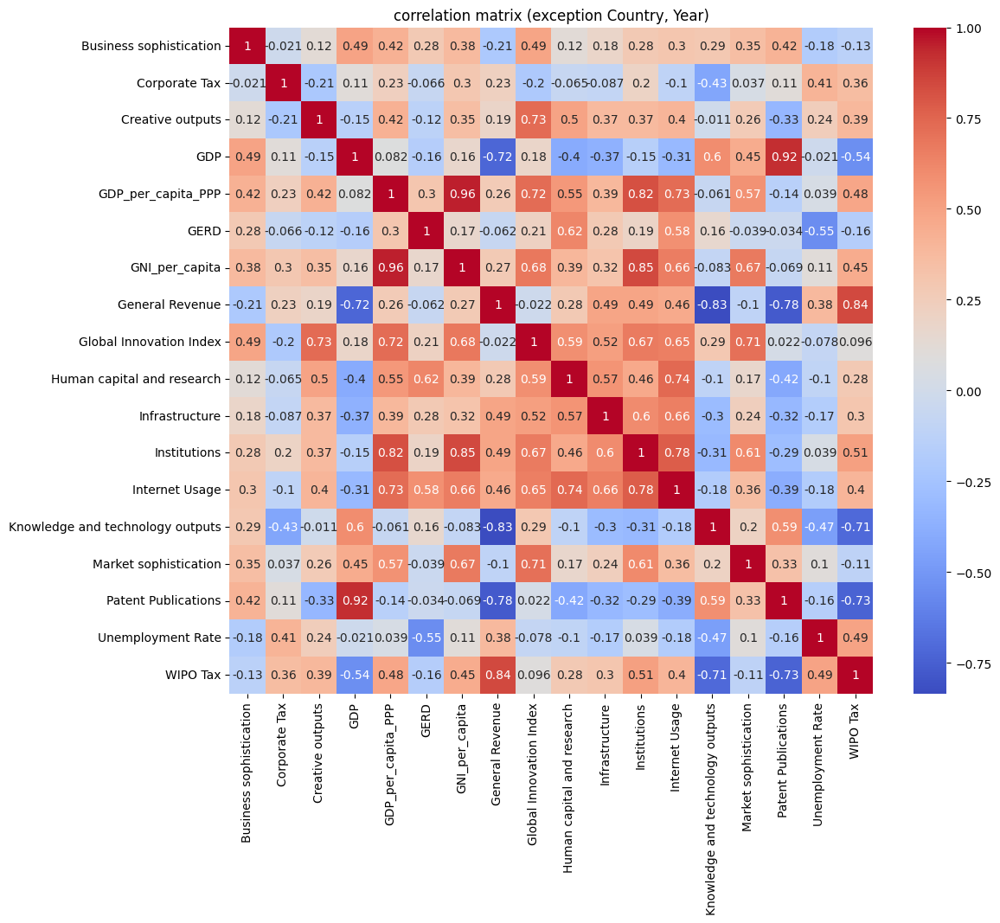

# **거시경제 시뮬레이션 사전 분석 보고서**

본 보고서는 첨부된 **상관관계 행렬**(사진)과 추가 분석 결과를 토대로, 거시경제 시뮬레이션 실행 전 데이터에 대한 심층 분석을 정리한 것입니다.  
특히, **"Country"**와 **"Year"** 컬럼을 제외한 나머지 수치형 변수를 정규화 후 상관관계, 단위근 검정, VAR 모델, Ljung-Box 검정, 그리고 Laffer Curve 모델까지를 검토하였습니다.

---

## **1. 상관관계 분석**

### 1.1 상관관계 행렬
“Country”와 “Year” 컬럼을 제외하고, 나머지 변수를 정규화한 뒤 계산한 **상관관계 행렬**을 시각화한 결과



1. **Business sophistication**  
   - **GDP**와 양(+)의 상관관계를 가지며(약 0.48)
   - **General Revenue**와는 0.21 정도의 낮은 상관

2. **Corporate Tax**  
   - **GDP**와 -0.16 정도로 다소 낮은 음(-)의 상관관계.  
   - **Patent Publications**와 -0.07, **Unemployment Rate**와 0.11 등 전반적으로 낮은 절댓값

3. **Creative outputs**  
   - **Knowledge and technology outputs**와 준수한 양의 상관(0.42)
   - **GDP**와는 0.23 정도의 양(+)의 상관

4. **GDP**  
   - 주요 변수 중 **Business sophistication**, **General Revenue**, **Knowledge and technology outputs**, **Patent Publications**, **WIPO Tax**와 절대 상관계수 0.45 이상  
   - **GDP_per_capita_PPP**, **GNI_per_capita** 등과도 0.30 ~ 0.40대 상관관계

5. **GDP_per_capita_PPP**  
   - **GDP**와 0.41 정도로 양(+)의 상관관계
   - **Internet Usage**와 0.32
   - **Human capital and research**와 0.29

6. **GERD** (R&D 지출)  
   - **Patent Publications**와 0.36 정도로 양(+)의 상관 
   - **Knowledge and technology outputs**와도 약 0.40

7. **GNI_per_capita**  
   - **GDP**와 **GDP_per_capita_PPP**와 높은 상관(0.38, 0.49)  

8. **General Revenue**  
   - **GDP**와 0.49, **WIPO Tax**와 -0.15, **Knowledge and technology outputs**와 -0.32 
   - 상관관계가 강한 변수는 GDP(양)와 Business sophistication(약 0.24).

9. **Global Innovation Index**  
   - **Business sophistication**과 0.40, **Knowledge and technology outputs**와 0.43.  
   - **GDP**와는 0.35 정도의 양(+) 상관

10. **Human capital and research**  
    - **GERD**와 0.41, **Knowledge and technology outputs**와 0.29.  
    - **GDP**와 0.22 정도로 다소 양(+) 상관

11. **Infrastructure**  
    - **Institutions**와 0.48, **Internet Usage**와 0.50 근처 
    - **GDP**와는 0.27 정도.

12. **Institutions**  
    - **Infrastructure**와 0.48, **Market sophistication**와 0.34
    - **GDP**와는 0.25.

13. **Internet Usage**  
    - **Infrastructure**와 0.50, **GDP**와 0.33
    - **Knowledge and technology outputs**와 약 0.29

14. **Knowledge and technology outputs**  
    - **GDP**와 0.53 근처, **Patent Publications**와 0.34, **WIPO Tax**와 0.71 정도로 매우 높은 양(+) 상관
    - **Business sophistication**와 0.35

15. **Market sophistication**  
    - **Business sophistication**와 0.39, **GDP**와 0.28

16. **Patent Publications**  
    - **GDP**와 0.48, **WIPO Tax**와 -0.74 (강한 음(-)의 상관) 
    - **Knowledge and technology outputs**와 -0.30 (다소 음(-))

17. **Unemployment Rate**  
    - **GDP**와 -0.21, **Business sophistication**와 -0.12 등 대체로 낮은 음(-) 상관 
    - **WIPO Tax**와 -0.05

18. **WIPO Tax**  
    - **Knowledge and technology outputs**와 0.71 (강한 양(+)), **Patent Publications**와 -0.74 (강한 음(-))  
    - **GDP**와 0.40, **General Revenue**와 -0.15

---

## **2. GDP와 상관계수 0.45 이상인 변수들**
정량 분석 결과, **GDP**와 절댓값 0.45 이상의 상관관계를 보이는 변수:
['Business sophistication', 'GDP', 'General Revenue', 'Knowledge and technology outputs', 'Patent Publications', 'WIPO Tax']

- 추후 거시경제 시뮬레이션이나 Laffer Curve 모델 구축 시 중요한 후보로 사용 가능

---

## **3. ADF Test 결과 및 차분결과**

### 3.1 ADF Test
- 추출한 변수 각각에 대해 **ADF Test**를 수행한 결과:

```plaintext
ADF Test for Business sophistication: 
  Test Statistic = -3.2664, p-value = 0.0164 
  => 정상

ADF Test for GDP: 
  Test Statistic = -0.3652, p-value = 0.9157 
  => 비정상

ADF Test for General Revenue: 
  Test Statistic = -1.4295, p-value = 0.5681 
  => 비정상

ADF Test for Knowledge and technology outputs: 
  Test Statistic = -2.7370, p-value = 0.0678 
  => 비정상

ADF Test for Patent Publications: 
  Test Statistic = -1.6495, p-value = 0.4573 
  => 비정상

ADF Test for WIPO Tax: 
  Test Statistic = -2.3427, p-value = 0.1586 
  => 비정상
```
- Business sophistication: 정상적이므로 차분 불필요

- GDP, General Revenue, Knowledge and technology outputs, Patent Publications, WIPO Tax: 비정상 → 1차 차분 필요

### 3.2 1차 차분된 데이터
비정상인 변수를 차분 적용 후, NaN 제거를 통해 최종 차분 데이터셋을 생성
아래 5개 변수가 1차 차분

- GDP 
- General Revenue
- Knowledge and technology outputs
- Patent Publications
- WIPO Tax


## **4. 최적 Lag 수 (AIC vs BIC) 및 VAR 모델 요약**
### 4.1 최적 Lag 수
- AIC 기준: 10
- BIC 기준: 0
※ AIC=10을 채택

### 4.2 VAR 모델 요약
lag=10으로 피팅한 VAR 모델 결과 요약(일부):

```plaintext
No. of Equations: 5
Log likelihood: 392.122
AIC: -18.8376
BIC: -9.85839
...
Results for equation GDP:
  const, L1.GDP, L1.Knowledge..., ...
  L10.GDP (p=0.000), L10.Patent Publications (p=0.002), ...
...
```

- 일부 lag 항에서 유의한 계수(p<0.05)가 나타남
- GDP는 지연된 GDP, Patent Publications, Knowledge and technology outputs 등의 영향을 받는 것으로 해석 가능

## **5. Ljung-Box Test 결과**
- 각 변수별 VAR 모델 잔차에 대해 Ljung-Box 검정을 실시

```plaintext
- GDP: lb_stat=26.269814, lb_pvalue=0.003394  => 백색 잡음 아님
- General Revenue: lb_stat=18.305688, lb_pvalue=0.050021 => 경계
- Knowledge and technology outputs: lb_stat=18.707072, lb_pvalue=0.044145 => 백색 잡음 아님
- Patent Publications: lb_stat=20.653003, lb_pvalue=0.023647 => 백색 잡음 아님
- WIPO Tax: lb_stat=11.467383, lb_pvalue=0.322282 => 백색 잡음
```
- GDP, Knowledge and technology outputs, Patent Publications 등의 잔차가 백색 잡음이 아니므로, 
- 모델 개선(Lag 수 조정, 추가 변수 고려, 또는 다른 모형 도입)이 필요

## **6. macroeconomic_simulation 모델 실행 시 고려 사항**
### 6.1 데이터 전처리
- 정상 시계열: Business sophistication
- 1차 차분: GDP, General Revenue, Knowledge and technology outputs, Patent Publications, WIPO Tax

- 시뮬레이션 시 차분된 데이터(또는 공적분 모형 등)로 VAR/VARMAX를 구축해야 함

### 6.2 Lag 선택
- AIC 기준 lag=10, BIC 기준 lag=0
- 실제 macroeconomic_simulation에서는 lag=10 사용 시 과적합 위험도 있으므로, 추가적인 검토(예: BIC=0, HQIC, Cross-Validation) 필요

### 6.3 모형 적합도 점검
- Ljung-Box 결과에서 일부 변수 잔차가 백색 잡음이 아님
→ 모형 개선 또는 exogenous 변수 추가(예: AI 세율), VECM(공적분) 고려

### 6.4 Laffer Curve 활용
- WIPO Tax 등 세율 관련 변수를 exogenous로 설정하여, Laffer Curve로부터 도출된 최적 세율을 시나리오별로 투입
- “사용자 입력 세율 vs 최적 세율”을 비교 예측 가능

## **7. 결론**
- 상관관계 분석: Business sophistication, General Revenue, Knowledge and technology outputs, Patent Publications, WIPO Tax가 GDP와 강한 상관성을 보임

- ADF 테스트 결과: Business sophistication만 정상적이고 나머지는 비정상 → 1차 차분 후 VAR 모델 피팅이 필요

- VAR 모델(최적 Lag=10, AIC 기준) 결과, 일부 lag 항에서 유의한 계수가 나타나며, Ljung-Box 검정에서 잔차가 백색 잡음이 아님을 보여 모델 개선 가능성이 제기

- 향후 macroeconomic_simulation 모델을 실행할 때, 차분된 데이터(또는 공적분 접근)와 exogenous 변수 설정(세율, Laffer Curve 결과)을 고려하여 시나리오별 예측을 진행해야 함.