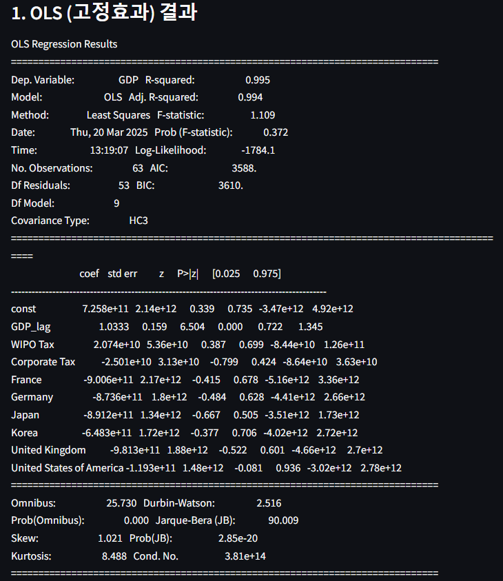
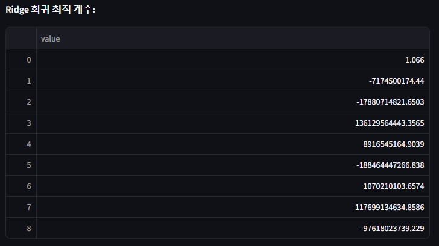
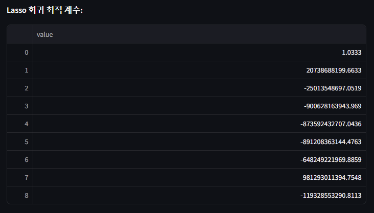
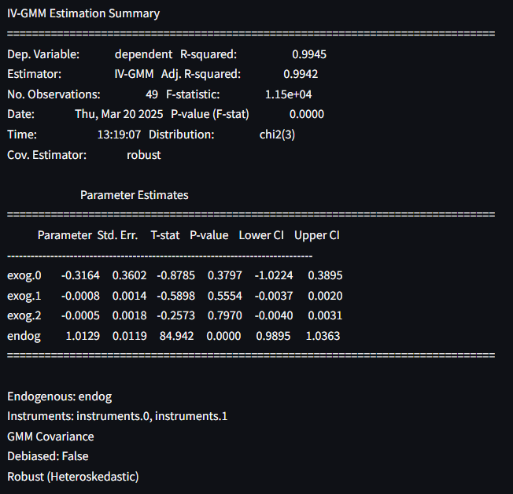
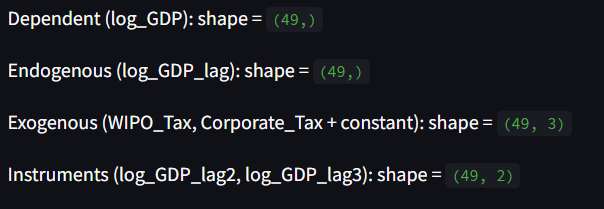
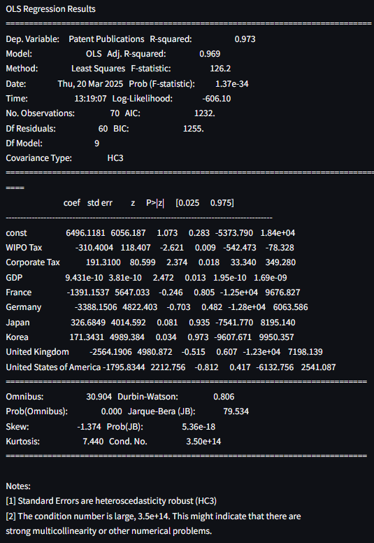
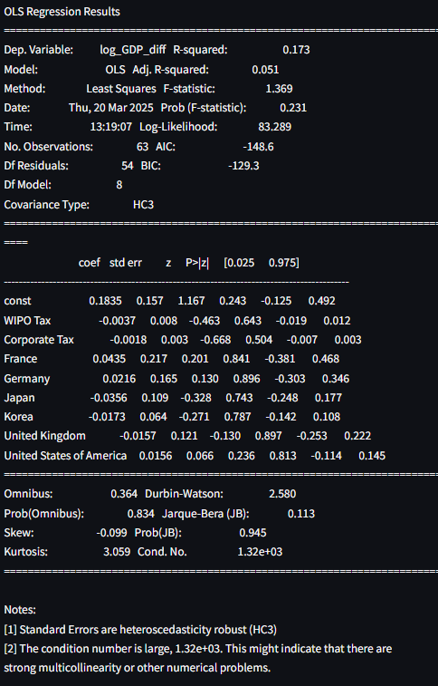

# Q1 분석 보고서

## 1. 연구 개요

본 연구는 **AI 세금이 기업 투자와 경제 성장에 미치는 영향**을 다각적으로 분석하기 위해 여러 패널 데이터 모형을 적용하였습니다.  
주요 분석 모형은 다음과 같습니다:

- **OLS (고정효과) 회귀 모형**: 각 국가의 GDP에 영향을 미치는 선형 효과를 추정하며, 국가별 고정효과(더미 변수)를 포함하여 분석합니다.
- **Ridge 및 Lasso 회귀 모형**: 교차검증(GridSearchCV)을 통해 최적의 정규화 계수를 선택하고, 두 모형의 최적 회귀 계수를 하나의 표로 결합하여 비교합니다.
- **동태적 패널 IV GMM 모형**:  
  - **종속 변수 (dependent)**: 로그 GDP (log_GDP)  
  - **내생 변수 (endog)**: 전 시점의 로그 GDP (log_GDP_lag)  
  - **도구 변수 (instruments)**: 전전 시점 및 전전전 시점의 로그 GDP (log_GDP_lag2, log_GDP_lag3)  
  - **외생 변수 (exog)**: 상수항 및 외생 변수(WIPO Tax, Corporate Tax)  
  IVGMM 모형은 내생성 문제를 보완하기 위해 위와 같이 4개의 핵심 인자를 명시적으로 전달하여 피팅
- **기업 투자 모형**: 특허 출원 수(Patent Publications)를 종속 변수로 하여, AI 세금(대리 변수: WIPO Tax, Corporate Tax) 및 GDP 등의 영향을 분석합니다.
- **경제 성장률 모형**: GDP의 로그 차분을 종속 변수로 하여 단기 경제 성장률 변동에 미치는 AI 세금의 효과를 평가합니다.

## 2. 데이터 전처리 및 균형 패널 구성

- **데이터 변환 및 균형 패널 구성**  
  원본 데이터에서 `Year`, `GDP`, `WIPO Tax`, `Corporate Tax` 등 필요한 컬럼들을 numeric으로 변환한 후, 각 국가의 공통 관측 연도를 추출하여 균형 패널 데이터를 구성하였습니다.  
  이 과정을 통해 불균형 데이터를 제거하고, 모든 국가에 대해 동일한 시계열을 확보할 수 있었습니다.

## 3. 모형별 분석 결과

### 3.1 OLS (고정효과) 회귀 모형

- **모형 피팅 결과**:  
  OLS 모형은 높은 설명력(R² ≈ 0.995)을 보였습니다.

### 3.2 Ridge 및 Lasso 회귀 모형

- **회귀 계수 비교**:  
  - **Ridge 회귀**에서는 WIPO Tax와 Corporate Tax의 회귀 계수가 표준 오차가 크고 t-통계량이 낮아 통계적 유의성이 부족한 것으로 나타났습니다.
  - **Lasso 회귀**에서는 일부 계수가 0에 매우 가까워지거나 0으로 수축되는 경향이 관찰되어, 해당 변수들이 GDP에 미치는 직접 효과가 제한적임을 시사합니다.
- **결과 표**:  
  두 모형의 최적 계수를 하나의 DataFrame(표)로 결합하여, 각 변수별 Ridge와 Lasso 회귀 결과를 비교할 수 있습니다.

|        Ridge 회귀 최적 계수          |           Lasso 회귀 최적 계수        |
|:-----------------------------------:|:------------------------------------:|
|  |   |

### 3.3 동태적 패널 IV GMM 모형

- **모형 구성**:  
  - **종속 변수 (dependent)**: `log_GDP`  
  - **내생 변수 (endog)**: `log_GDP_lag`  
  - **도구 변수 (instruments)**: `log_GDP_lag2`, `log_GDP_lag3`  
  - **외생 변수 (exog)**: 상수항 및 `WIPO Tax`, `Corporate Tax`  
- **결과 분석**:
  IV GMM 모형 결과에서 내생 변수인 `log_GDP_lag`의 계수는 1.0129로 매우 강한 양의 영향을 나타내며, P-value < 0.001로 통계적으로 유의함을 보여줍니다.  
  외생 변수의 효과는 상대적으로 미미하며, 전체 모형의 설명력(R² ≈ 0.9945) 역시 매우 높게 나타났습니다.

|                 IV GMM                 |                데이터 요약               |
|:--------------------------------------:|:---------------------------------------:|
|  |  |

### 3.4 기업 투자 및 경제 성장 모형

- **기업 투자 모형**:  
  특허 출원 수를 종속 변수로 사용한 OLS 모형 결과, AI 세금 관련 변수(WIPO Tax, Corporate Tax)가 통계적으로 유의한 영향을 나타내어, AI 세금 정책이 기업의 연구개발 및 특허 활동에 영향을 줄 수 있음을 시사합니다.

  
- **경제 성장률 모형**:  
  GDP 로그 차분을 종속 변수로 사용한 모형에서는 단기 성장률 변동에 대한 AI 세금 변수의 영향이 미미하거나 통계적으로 유의하지 않은 것으로 나타났습니다.

## 4. 종합 결론 및 심층 분석

- **Ridge 및 Lasso 회귀 결과 분석**:  
  Ridge 회귀에서는 WIPO Tax와 Corporate Tax 계수가 통계적 유의성이 낮아, 이들 변수가 GDP에 미치는 직접 효과가 명확하지 않음을 보여줍니다.  
  Lasso 회귀에서는 일부 계수가 0에 매우 가깝게 수축되어, 변수 선택 과정에서 해당 변수들의 설명력이 제한적으로 나타납니다.

- **IVGMM 모형 상세 분석**:  
  IVGMM 모형은 내생성 문제를 보완하기 위해 전 시점의 GDP(로그 변환 후 시차 변수)를 내생 변수로, 그 이후 두 시점을 도구 변수로 활용합니다.  
  결과에서 내생 변수인 `log_GDP_lag`의 계수가 1.0129로 나타나 강한 양의 영향을 미치며, 이는 기업의 장기 투자 및 경제 성장에 중요한 역할을 할 가능성을 시사합니다.  
  외생 변수(WIPO Tax, Corporate Tax)의 효과는 상대적으로 미미하나, 모형 전체의 설명력은 매우 높습니다.

- **기업 투자 및 경제 성장에 미치는 AI 세금의 영향**:  
  기업 투자 모형 결과는 AI 세금 정책이 특허 출원과 같은 기업 투자 활동에 유의한 영향을 미칠 수 있음을 보여줍니다.  
  반면, 경제 성장률 모형에서는 단기 GDP 성장률에 미치는 효과가 다소 약하게 나타났으나, IVGMM 모형을 통해 장기적 구조 효과가 강조되고 있습니다.

- **종합적 고찰**:  
  본 연구는 다양한 모형을 통해 AI 세금이 기업 투자와 경제 성장에 미치는 복합적 영향을 평가하였습니다.  
  - **OLS 모형**은 높은 설명력을 보이나 다중공선성 문제의 가능성을 내포합니다.  
  - **Ridge 및 Lasso 회귀**는 정규화 기법을 통해 일부 변수의 효과를 축소하거나 0으로 만드는 경향을 보이며, 단순 선형 모형은 한계가 있음을 시사합니다.  
  - **IVGMM 모형**은 내생성 문제를 보완하여 장기적인 경제 구조 효과를 분석하는 데 유용하며, 내생 변수의 강한 영향력을 확인할 수 있었습니다.  
  - **기업 투자 및 경제 성장 모형**은 AI 세금 정책이 각각 기업의 투자 활동과 단기 경제 성장에 미치는 효과를 다각도로 보여줍니다.
  
  종합적으로, AI 세금은 기업의 미래 투자 결정과 장기 경제 성장에 중요한 구조적 영향을 미칠 가능성이 있으며, 단순 선형 모형으로 설명하기 어려운 복합적 효과를 내포하고 있음을 시사합니다. 추가적인 모형 개선과 외부 변수 고려를 통해 보다 정교한 분석이 요구됩니다.

---

# 참고: Q1_logic.py 및 Q1.py 코드 개요

- **Q1_logic.py**  
  - `get_balanced_panel()`: 각 국가의 공통 연도를 기반으로 균형 패널 데이터를 구성합니다.  
  - `run_ols_with_fe()`: 고정효과 OLS 회귀 모형을 피팅합니다.  
  - `run_ridge_lasso()`: Ridge와 Lasso 회귀 모형을 교차검증을 통해 최적화하고, 두 모형의 계수를 표로 결합하여 반환합니다.  
  - `run_dynamic_panel_gmm()`: IVGMM 모형을 수행하기 위해 log(GDP)와 그 시차 변수, 그리고 외생 및 도구 변수를 추출하여 IVGMM 생성자에 전달합니다.  
  - `run_investment_model()` 및 `run_growth_model()`: 각각 기업 투자와 경제 성장률에 미치는 효과를 분석하는 OLS 모형을 피팅합니다.

- **Q1.py**  
  - `run_Q1()`: 데이터 로딩 후 main_analysis()를 호출하여 각 모형의 결과 요약과 함께, Ridge/Lasso 회귀 최적 계수를 하나의 표로 통합하여 출력하고, IVGMM 데이터의 핵심 변수(shape 및 변수명)를 요약하여 표시합니다.