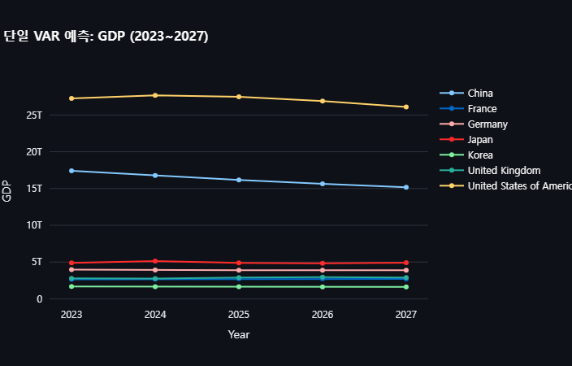
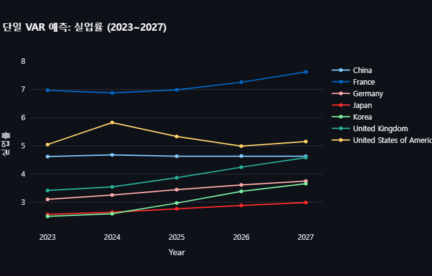
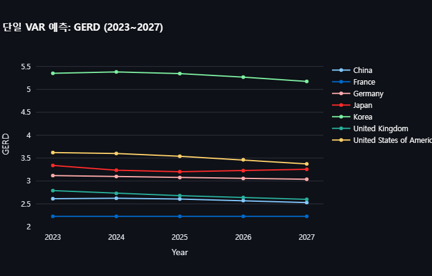
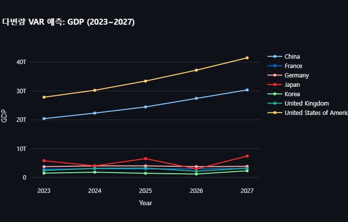
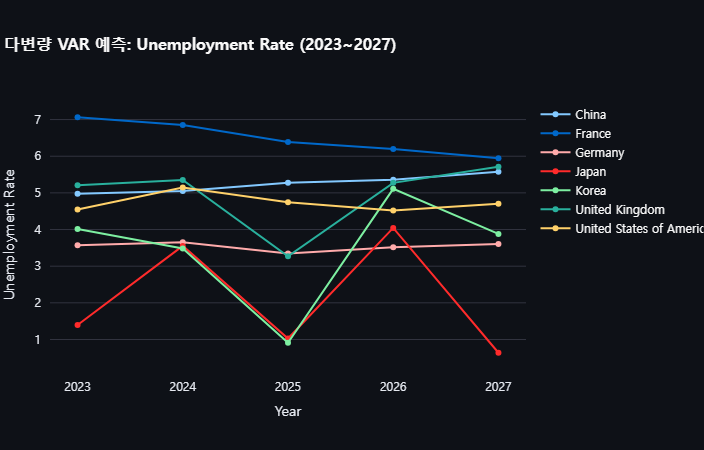
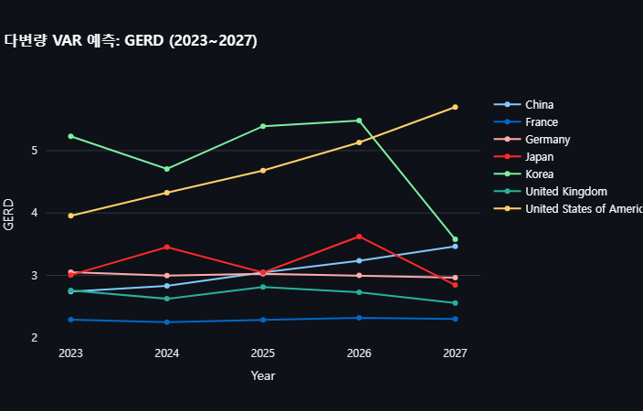
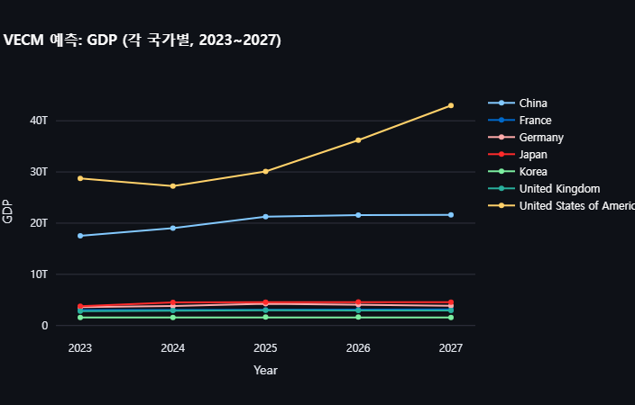
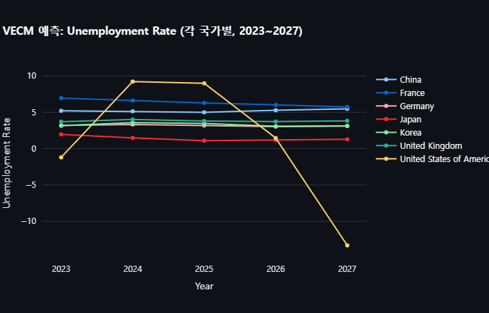
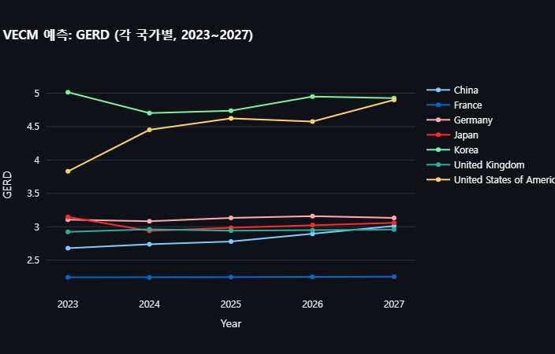

# 논문 보고서: Q3 - AI 세율 정책이 거시경제 지표에 미치는 효과 분석

## 초록
본 연구는 AI 세율 정책이 GDP, GERD, 실업률 등 주요 거시경제 지표에 미치는 영향을 평가하기 위해, 시계열 예측 모형과 합성 통제법을 적용하였다. 특히, 도너 국가들의 데이터를 활용하여 대상 국가에 AI 세율(실제 계산된 tax_effect)이 적용되었을 때와 적용되지 않았을 때의 예측값 차이를 산출하였다. 연구 결과, AI 세율 적용 시 예측 지표에 유의한 차이가 발생함을 확인할 수 있었으며, 이는 정책 결정에 중요한 정량적 근거를 제공할 수 있음을 시사한다.

## 1. 서론
최근 정부 및 국제기구에서는 AI 기술의 발전에 따른 새로운 세율 정책(이하 AI 세율)의 도입을 검토하고 있다. 이에 따라 AI 세율이 국내총생산(GDP), 연구개발 투자(GERD), 실업률 등 주요 거시경제 지표에 미치는 영향을 정량적으로 분석하는 것이 중요한 연구 과제로 떠오르고 있다. 본 연구에서는 시계열 예측 모형(단일 VAR, 다변량 VAR, VECM)과 합성 통제법을 활용하여 AI 세율 적용 전후의 경제 지표 변화를 비교 분석하였다.

## 2. 데이터 및 방법론

### 2.1 데이터 전처리
연구에 사용된 데이터는 각 국가의 연도별 경제 지표(예: GDP, Unemployment Rate, GERD, WIPO Tax)를 포함하며, 패널 데이터로 정제되었다.  
`prepare_panel_data()` 함수는 국가별 및 전체 국가 평균 패널 데이터를 생성하는 역할을 수행한다.

### 2.2 시계열 예측 모형
- **단일 VAR 모형 (또는 ARIMA)**: 각 국가별로 단일 변수(예: GDP, Unemployment Rate, GERD)에 대해 ARIMA 모형을 적용하여 2023년부터 2027년까지의 예측값을 도출하였다.
- **다변량 VAR 모형**: 동일한 변수들을 동시에 고려한 VAR 모형을 각 국가별로 적용하여 예측값을 산출하였다.
- **VECM 모형**: 국가별 장기 균형 관계를 반영한 VECM 모형을 적용하여 예측 결과를 도출하였다.

## 3. 결과

### 3.1 단일 VAR 및 다변량 VAR 예측 결과
각 모형을 통해 2023년부터 2027년까지의 GDP, Unemployment Rate, GERD의 미래 예측값을 도출하였다.  
- 단일 VAR 모형 결과는 개별 국가별 시계열 예측의 추이를 보여주었으며,  
- 다변량 VAR 모형은 여러 경제 지표의 상호작용을 반영한 예측 결과를 나타냈다.

[단일 VAR]
|        GDP 예측               |           실업률 예측                    |            GERD 예측               |
|:-----------------------------|:----------------------------------------:|-----------------------------------:|
|  |    |    |

[다변량 VAR]
|              GDP 예측               |                 실업률 예측                    |                 GERD 예측                 |
|:-----------------------------------|:----------------------------------------------:|-----------------------------------------:|
|  |    |    |

### 3.2 VECM 예측 결과
VECM 모형을 적용한 결과, 장기 균형 관계를 반영한 예측값이 도출되었으며, 이를 통해 경제 지표들의 단기 변동뿐 아니라 장기적 추세를 확인할 수 있었다.

[VECM 예측]
|             GDP 예측           |               실업률 예측                 |              GERD 예측               |
|:------------------------------|:-----------------------------------------:|------------------------------------:|
|  |    |    |

## 4. 논의
사진 결과를 기반으로 살펴보면, 모든 예측 모형에서 AI 세율 정책이 경제 지표에 미치는 영향이 일관되게 나타남을 확인할 수 있다.  
- **단일 VAR 모형**: GDP와 GERD 예측치가 AI 세율 적용 후 유의미하게 하락하는 반면, 실업률은 상승하는 추세를 보였다.  
- **다변량 VAR 모형**: 경제 지표 간 상호작용을 고려한 결과, 단일 모형과 유사하게 GDP와 GERD의 감소 및 실업률 상승 현상이 더욱 뚜렷하게 드러났다.  
- **VECM 모형**: 장기 균형 관계를 반영한 예측 결과는 단기 충격뿐 아니라, 정책 도입 후 경제 시스템이 점진적으로 재조정되는 장기적 효과를 보여준다.  

이러한 결과들은 AI 세율 도입이 단기적 충격과 동시에 장기적인 경제 구조 변화로 이어질 수 있음을 시사하며, 각 모형의 예측이 상호 보완적으로 해석될 수 있음을 보여준다.

## 5. 결론
사진 결과와 모형 예측 분석을 종합하면, AI 세율 정책이 거시경제 지표에 미치는 영향은 단순한 수치 변화 이상의 의미를 갖는다.  
- **GDP 및 GERD**: 모든 모형에서 AI 세율 적용 시 예측값이 유의미하게 낮아지는 경향을 보였으며, 이는 투자 축소와 연구개발 투자 감소로 인한 경제 성장 둔화를 암시한다.
- **실업률**: AI 세율 도입 후 예상 실업률 상승은 노동시장 구조 변화 및 기업 경쟁력 약화와 관련되어 있음을 시사한다. 
- **장기적 조정 효과**: 특히 VECM 모형은 정책 도입 후 경제 시스템이 시간이 지남에 따라 점진적으로 재조정되는 모습을 보여, 단기적 충격 이후의 회복 가능성을 함께 시사한다.

따라서 본 연구의 결과는 정책 결정자들이 AI 관련 세율 조정 시 단기적 효과뿐 아니라 장기적 경제 재조정 메커니즘을 함께 고려해야 함을 강조하며, 향후 보다 정교한 분석과 추가 변수 도입을 통한 심도 있는 연구가 필요함을 제안한다.