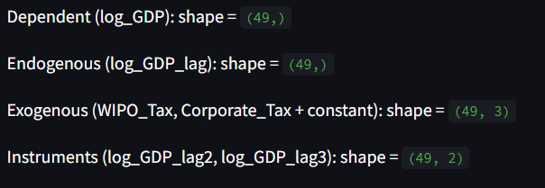
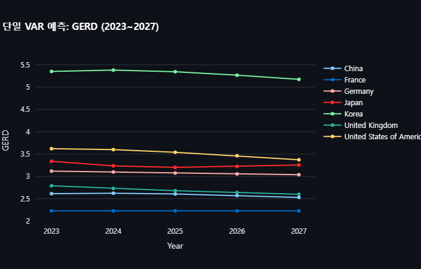
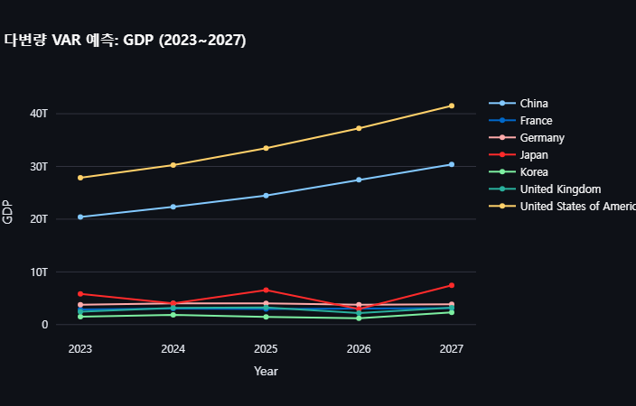
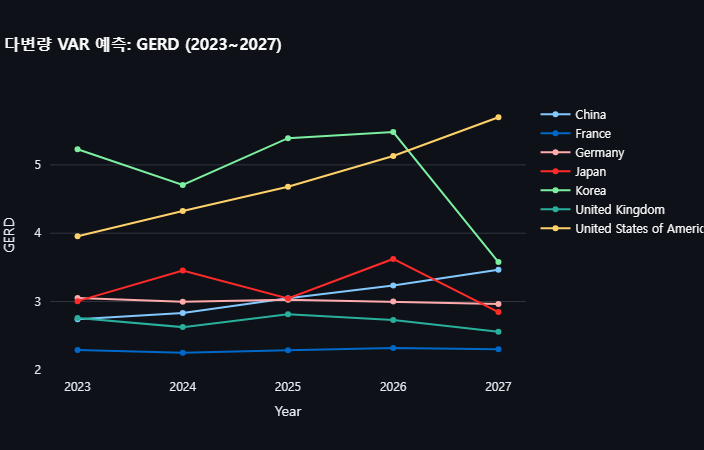
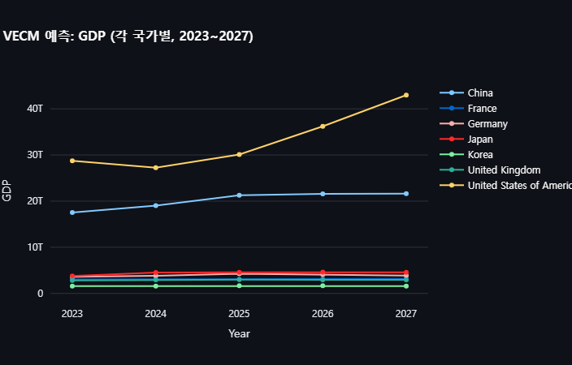
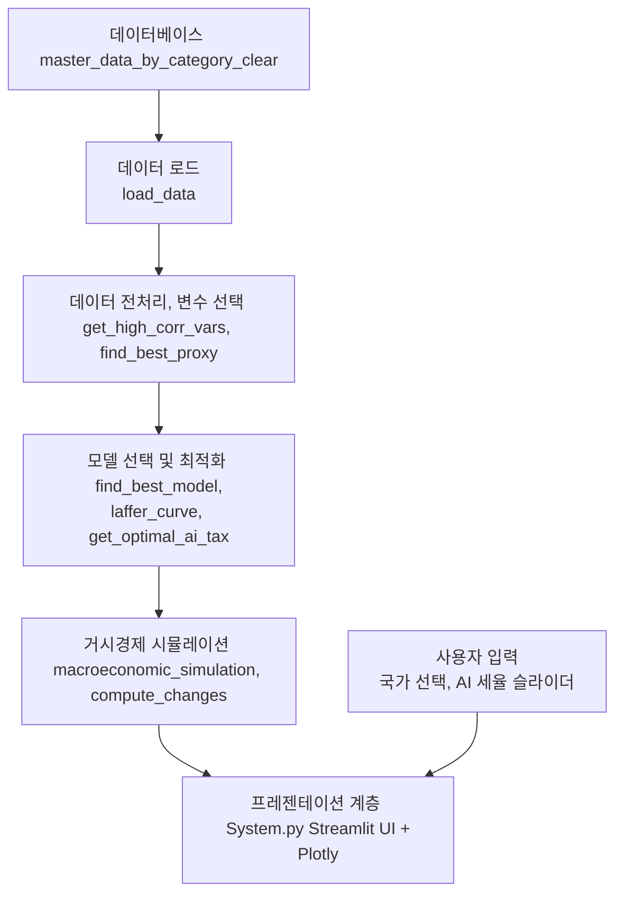
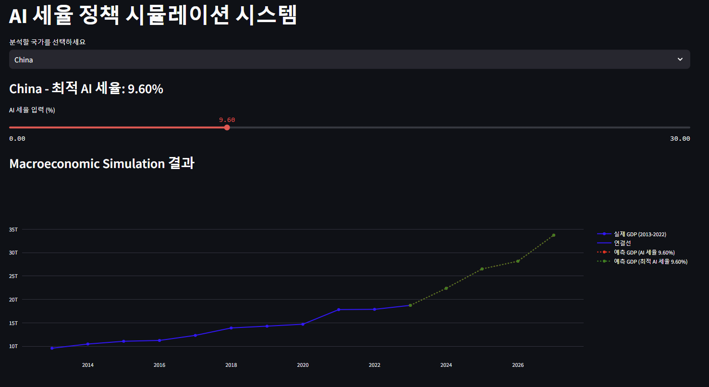
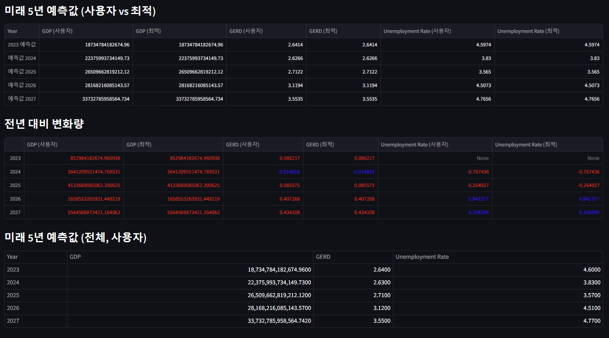

## **0. Abstract**

AI 도입으로 인한 경제적 변화를 분석하고, 이에 적합한 최적의 AI 세금을 설계하고 평가하는 것을 목적으로 한다. AI 기술이 산업 전반에 걸쳐 생산성 향상과 비용 절감 등 긍정적인 효과를 가져오고 있으나, 동시에 일자리 감소와 소득 불평등과 같은 부정적 문제를 야기하고 있어 적절한 정책적 대응이 필요한 시점이다. 본 연구는 AI 도입이 경제 성장과 고용 등에 미치는 영향을 포괄적으로 분석하였다. 이를 위해 본 연구에서는 다양한 경제 지표를 기반으로 AI 세율 최적화하고, Laffer Curve를 활용한 비선형 회귀 분석과 글로벌 최적화 알고리즘을 결합하여 경제 성장을 극대화할 수 있는 최적 세율을 산출하였다. 또한, 패널 데이터 분석과 VAR, VECM 등의 시계열 모형을 활용하여 AI 세율 도입이 주요 경제 지표에 미치는 영향을 실증적으로 평가하였다. 마지막으로, 이러한 연구 결과를 통합한 웹 기반 시뮬레이션 시스템을 구축하여 다양한 세율 시나리오의 경제적 영향을 즉각적으로 평가할 수 있도록 지원하였다. 본 연구의 결과는 AI 세율 정책 설계 시 장기적 경제구조 재조정 효과까지 고려할 필요가 있음을 시사하며, 향후 정책 결정 과정에서 중요한 근거로 활용될 수 있을 것으로 기대된다.

## **Ⅰ. Introduction (서론)**

최근 수년간 AI의 급격한 발전은 제조, 서비스, 금융 등 산업 전 분야에서 혁신적인 변화를 가져왔다. AI 기술의 도입은 기업의 생산성을 대폭 향상시키고, 비용 절감 및 신기술 개발 촉진을 통해 경제 전반의 경쟁력을 강화하는 데 기여하고 있다. 글로벌 컨설팅 기업 PwC의 연구에 따르면, AI 기술은 2030년까지 전 세계 GDP를 최대 14%, 약 15조 7천억 달러 증가시킬 수 있을 것으로 전망하고 있다. 이러한 잠재적 이익은 자동화와 데이터 기반 효율성 증가, 신규 서비스 창출 등 다양한 경제적 기회를 포함하고 있다.
그러나 AI 기술의 확대는 단지 긍정적인 영향만을 수반하지는 않는다. AI 기술 도입이 확대될수록 자동화에 의한 일자리 소멸과 노동 시장의 구조적 변화가 불가피하게 발생하고 있다. 실제로 OECD는 자동화 기술이 노동시장에 미치는 영향을 분석한 결과, 향후 10~20년 내에 회원국 내 일자리의 약 14%가 완전히 자동화될 가능성이 있다고 경고했다. 특히 제조업, 물류업, 금융업 등의 특정 산업군에서는 일자리 대체 현상이 더 심각할 것으로 예상된다. 이러한 구조적 변화는 노동자들의 일자리 불안과 소득 불평등 심화라는 사회경제적 문제를 야기할 수 있다.
이러한 상황에서 AI 기술 도입에 따른 긍정적 경제효과와 부정적 사회경제적 영향을 균형 있게 관리하기 위한 정책적 대응이 요구되고 있다. 특히, AI로 인해 발생하는 경제적 편익과 사회적 비용을 동시에 고려하여 최적화된 세금 정책을 설계하는 것이 중요해지고 있다. 일부 국가와 국제기구는 이미 로봇세(Robot Tax)나 디지털세(Digital Tax) 등의 새로운 형태의 세금 정책을 검토하고 있으며, 미국과 유럽에서는 빅테크 기업의 초과 이익에 대해 특별한 과세를 부과하는 방안을 논의 중이다. 이에 본 연구는 AI 도입으로 인한 경제적 변화에 효과적으로 대응하기 위한 세율 최적화 연구의 필요성을 제기하며, 관련 데이터를 기반으로 실증적 분석을 수행하였다.
본 연구의 구체적인 목적은 다음과 같다. 첫째, AI 도입이 경제성장, 고용 구조, 소득 분배와 같은 주요 경제지표에 구체적으로 어떤 영향을 미치는지를 분석한다. 이를 위해 세계은행, OECD, IMF 등 국제 기구가 제공하는 각국의 GDP, 실업률, 연구개발 투자(이하 GERD) 등 다양한 패널 데이터를 활용하였다. 둘째, AI 관련 세금정책의 국내외 사례와 효과성을 살펴보고 이를 통해 향후 한국의 정책적 대응 방향을 모색하였다. 셋째, AI 세율 최적화를 위한 효과적인 알고리즘을 제안하고, Laffer Curve를 활용한 비선형 회귀분석과 Differential Evolution과 같은 글로벌 최적화 알고리즘을 결합하여 경제 성장과 세수 증대를 동시에 달성할 수 있는 최적 세율을 도출하였다. 마지막으로, 도출된 세율 정책의 효과를 실증적으로 평가하고, 다양한 세율 시나리오의 경제적 영향을 예측할 수 있는 웹 기반 AI 세금 정책 시뮬레이션 시스템을 개발하였다.

## **Ⅱ. Related Works (관련 연구)**

### **2.1 AI 도입과 경제 변화**

AI 기술의 도입은 생산성 향상과 경제 성장에 긍정적인 영향을 미치고 있습니다. 예를 들어, (1) H&R블록은 생성형 AI 환경인 'AI 택스 어시스트'를 도입하여 세금 양식 정보 제공부터 세금 규칙 및 법률 변경 안내까지 다양한 세금 관련 질문에 답변을 제공하고 있습니다. (2)이는 세무 업무의 효율성을 높이고 정확성을 향상시켜 납세자에게 더 나은 서비스를 제공하는 사례입니다.
그러나 AI의 도입은 노동 시장의 구조적 변화를 초래하여 고용 불안정과 소득 불평등을 심화시킬 우려도 있습니다. (3) MIT 경제학자들의 연구에 따르면, 로봇에 대한 적절한 세금이 소득 불평등을 줄이기 위한 최적의 정책이 될 수 있다고 제안하고 있습니다.

### **2.2 AI 세금 개념 및 정책 사례**
AI 도입으로 인한 경제적 변화에 대응하기 위해 다양한 세금 정책이 논의되고 있습니다. 예를 들어, 국세청은 'AI 세금비서' 서비스를 도입하여 사업자의 부가가치세 신고서를 전산으로 자동 작성해주는 서비스를 제공하고 있습니다. 이는 납세자에게 편의를 제공하고 세무 업무의 효율성을 높이는 사례입니다.
(4) 또한, AI를 활용하여 세무 전문가들이 복잡한 세법 연구와 신고 업무를 보다 효율적이고 정확하게 처리할 수 있도록 돕는 AI 에이전트가 개발되고 있습니다. 이는 세무 업무의 효율성을 높이고 정확성을 향상시키는 데 기여하고 있습니다. 

### **2.3 AI 세율 최적화 관련 연구**

AI 도입에 따른 경제적 영향을 고려하여 최적의 세율을 산출하기 위한 연구도 진행되고 있습니다. (5) 예를 들어, 심층 강화학습 기반 조세 및 경제 활동 에이전트 정책 최적화 시뮬레이션 환경을 분석하고 실험한 연구가 있습니다. 이 연구에서는 AI 기반 경제 시뮬레이션 환경인 AI Economist를 활용하여 조세 및 경제 활동 에이전트 정책 최적화를 실험하고 분석하였습니다. 
또한, AI를 활용하여 탈세 혐의자를 식별하고, 암호화폐 거래를 추적하며, 딥페이크 사기를 탐지하는 등 세무 조사에 AI를 활용하는 연구도 진행되고 있습니다. 이는 세무 조사 업무의 효율성을 높이고 정확성을 향상시키는 데 기여하고 있습니다.
이러한 관련 연구들을 종합해 볼 때, AI 도입으로 인한 경제적 변화에 대응하기 위한 세금 정책의 필요성이 강조되고 있으며, 이를 위한 다양한 연구와 시도가 이루어지고 있음을 알 수 있습니다.

## **Ⅲ. Proposed Method (제안하는 방법)**

본 연구에서는 AI 세율이 경제 전반에 미치는 영향을 분석하고, 경제 성장과 세수 확보를 동시에 달성할 수 있는 최적 AI 세율을 산출하는 방법을 제안한다. AI 기술 도입으로 인해 변화하는 경제 환경 속에서 적절한 세율을 설정하는 것은 매우 중요하며, 이를 위해 두 가지 주요 방법론을 적용하였다.

### **3.1 AI 세율 최적화(Laffer Curve 기반)** 
AI 세율 최적화를 위해 먼저 GDP와 상관관계가 높은 주요 경제 지표들을 추출하였다. GDP와의 높은 연관성을 가진 변수를 선정한 뒤, 이 변수들을 다양한 방식으로 조합하여 Proxy(대리 변수)를 생성하였다. 이 과정에서는 변수들을 정규화하여 MinMaxScaler를 활용해 값의 범위를 일정하게 맞추고, 다양한 조합을 통해 AI 세율과 가장 잘 설명될 수 있는 변수를 선정하였다. 이후 최적의 Proxy 변수를 선택하기 위해 다항 회귀 모형을 구축하였으며, Bayesian Information Criterion(BIC)를 기준으로 최적의 모델을 선택하였다. 이러한 과정은 과적합을 방지하면서 설명력이 높은 최적 모델을 산출하기 위함이다. 최종적으로 선택된 Proxy 변수는 Laffer Curve을 활용하여 비선형 회귀로 모델링하였으며, 글로벌 최적화 알고리즘인 Differential Evolution를 사용하여 GDP를 최대화할 수 있는 최적 AI 세율을 도출하였다.

### **3.2 경제적 영향 분석**
경제적 영향을 분석하기 위해서는 AI 세율의 도입이 주요 거시경제 지표에 미치는 영향을 평가하기 위한 패널 데이터 모형 및 시계열 예측 모형을 활용하였다. 본 연구에서 적용한 방법은 크게 OLS 회귀 모형, Ridge 및 Lasso 회귀 모형, 동태적 패널 IV GMM 모형으로 나눌 수 있다. OLS 회귀 모형은 국가별 고정효과를 포함하여 GDP에 영향을 미치는 선형적 관계를 추정하였으며, Ridge 및 Lasso 회귀 모형은 교차검증을 통해 최적의 정규화 계수를 선택하여 변수들의 통계적 유의성을 분석하였다. 동태적 패널 IV GMM 모형에서는 내생성 문제를 해결하기 위해 과거의 GDP 값을 도구변수로 활용하여 설계하였다. 이외에도 기업 투자 및 단기 경제 성장에 미치는 영향을 분석하기 위해 특허 출원 수와 GDP 로그 차분을 활용한 추가적인 분석도 실시하였다. 시계열 예측 분석에서는 VAR 모형과 VECM 모형을 활용하여 GDP, 연구개발 투자(이하 GERD), 실업률 등의 지표가 AI 세율 적용 시 어떻게 변화할지 장기적이고 단기적인 관점에서 분석하였다. 특히, 합성 통제법을 통해 AI 세율 도입 전후의 경제 지표 변화를 보다 명확하게 평가하여 AI 세율 정책의 효과성을 실증적으로 분석하였다.

## **Ⅳ. Experimental Results (실험 결과)**
### **4.1 AI 세율 최적화 결과**
제안된 방법을 통해 AI 세율 최적화를 수행하기 위해 단일 변수와 복합 변수 접근법을 모두 사용하여 GDP와의 관계를 라퍼 곡선 형태로 모델링하였고, 여러 가지 조합 가운데 결정계수(R²)가 가장 높은 결과를 선별하였다. 최적화 과정에서 Differential Evolution과 Dual Annealing 등 다양한 글로벌 최적화 알고리즘을 활용하여 세율을 최적화하였으며, 이를 통해 경제적 성장을 극대화할 수 있는 AI 세율을 제안할 수 있었다.
### **4.2 패널 데이터 분석 결과**
패널 데이터 분석을 수행한 결과에서도 유의미한 통찰을 얻을 수 있었다. OLS 모형을 포함한 다양한 모형에서 AI 세금 관련 변수들의 경제적 효과가 분석되었으며, 특히 (사진1)고정효과를 포함한 OLS 모형의 설명력(R²)은 매우 높은 것으로 나타났다. AI 세금이 기업 투자와 경제 성장에 미치는 영향을 분석하기 위해 (사진1-1) 특허 출원 수를 종속변수로 사용한 OLS 모형 결과 세금 관련 변수가 통계적으로 유의한 영향을 나타내어 AI 세금 정책이 기업의 연구 개발과 특허 활동에 영향을 줄 수 있음을 확인했습니다. GDP 로그 차분을 종속 변수로 사용한 모형에서는 단기 성장률 변동에 대한 세금 변수의 영향이 미미하거나 통계적으로 유의하지 않은 것으로 나타났습니다.
(사진2) 반면, 동태적 패널 IV GMM 분석 결과에서는 과거 GDP 값의 강력한 내생성을 확인할 수 있었으며, 이는 AI 세율 정책이 단기적으로는 GDP 성장률에 미치는 효과가 약하게 나타났으나, 장기적 경제 성장과 구조적 투자에 긍정적인 역할을 할 수 있음을 시사한다. 기업 투자 및 경제 성장 분석에서는 AI 세율이 기업의 특허 출원 수 등 연구개발 활동에 유의미한 영향을 미쳤으며, 이는 AI 세금 정책으로 인한 비용을 줄이기 위한 연구에 영향을 미치며, 단기적인 경제 성장보다는 장기적 경제구조 개선에 더욱 효과적일 수 있음을 암시한다.

[사진 1. OLS 결과]
|                       OLS 모형 결과                        |
|:---------------------------------------------------------:|
| |

[사진 1-1  OLS 결과]
|                   OLS GDP                      |                 OLS Patent                 |
|:----------------------------------------------:|:------------------------------------------:|
|||

[사진 2. IV GMM 결과]
|                       IV GMM 결과                  |                    IV GMM 데이터 요약                  |
|:--------------------------------------------------:|:-----------------------------------------------------:|
|||

### **4.3 거시경제 시뮬레이션 결과**
거시경제 시뮬레이션 분석을 통해 AI 세율 정책의 효과성을 구체적으로 평가하였다. (사진3, 4) VAR과 VECM 모형을 통해 분석한 결과, AI 세율 정책 적용 시 GDP와 GERD가 감소하고 실업률은 증가하는 현상이 나타났다. 이는 AI 세율 정책 도입 초기에는 기업 투자가 일시적으로 위축되고 노동 시장의 불안정이 발생할 수 있음을 시사한다. 그러나 VECM 모형을 통한 장기적 분석에서는 경제 시스템이 점차 새로운 균형 상태를 찾으며 장기적으로 안정화될 가능성도 보여주었다. 또한 합성 통제법을 통해 AI 세율 정책 적용 전후의 경제 지표 차이를 명확히 평가하여, AI 세율의 실제 도입이 주요 거시경제 지표에 미치는 구체적인 영향을 정량적으로 분석하였다. 이러한 실험 결과들은 AI 세율 정책이 경제 구조 전반에 중요한 영향을 미칠 수 있으며, 이에 따라 세율 정책의 설계와 시행에 신중하고 정밀한 접근이 필요함을 강조한다.

[사진 3-1 단일 VAR]
|         GDP 예측              |           실업률 예측                    |            GERD 예측               |
|:----------------------------:|:----------------------------------------:|:----------------------------------:|
|  |    |    |

[사진 3-2 다변량 VAR]
|              GDP 예측               |                 실업률 예측                    |                 GERD 예측                 |
|:----------------------------------:|:----------------------------------------------:|:----------------------------------------:|
|  |    |    |

[사진 4. VECM 예측]
|             GDP 예측           |               실업률 예측                 |              GERD 예측               |
|:-----------------------------:|:-----------------------------------------:|:-----------------------------------:|
|  |    |    |

결과를 좀 더 세부적으로 살펴보면, AI 세율의 도입이 경제 전반에 미치는 파급 효과는 명확하게 드러났다. 단일 변수 VAR 모형을 이용한 분석 결과에서는 GDP와 GERD의 미래 예측치가 AI 세율 도입 이후 하락하는 반면, 실업률은 상승하는 경향이 뚜렷하게 나타났다. 이러한 현상은 AI 세율의 부과가 기업들의 초기 투자 비용과 연구개발 활동의 축소로 이어지고, 이는 단기적으로 경제 성장에 다소 부정적인 충격을 줄 수 있다는 점을 시사한다. 특히, 실업률 증가 현상은 AI 기술에 따른 자동화와 더불어 세금으로 인한 기업 비용 증가로 인해 노동시장의 구조 조정이 불가피하게 발생할 가능성을 암시하고 있다.

또한, 다변량 VAR 분석에서는 GDP, GERD, 실업률 등 여러 경제 지표들이 서로 복합적으로 영향을 미친다는 사실을 확인하였다. 예를 들어, GDP와 GERD가 동시에 감소하면 투자 감소로 인해 일자리 창출이 둔화되고, 이는 곧 실업률 증가로 연결되는 구조적인 악순환이 발생할 가능성을 제기하였다. 따라서 AI 세율 정책은 단일 지표에만 국한되지 않고 다양한 경제 지표들의 복합적 상호작용을 신중하게 고려하여 설계되어야 한다는 점을 실험 결과를 통해 확인할 수 있었다.

VECM 모형은 단기 충격뿐만 아니라 장기적인 균형 관계를 고려하여 더욱 심도 있는 분석 결과를 제공하였다. AI 세율 도입 이후 초기에는 GDP 및 GERD 감소, 실업률 증가라는 부정적 효과가 나타나지만, 시간이 흐르면서 경제 구조가 새로운 균형 상태로 점진적으로 이동하는 양상을 보였다. 장기적으로 기업과 경제 시스템이 AI 세율에 적응하면서 오히려 더 효율적인 경제 환경을 구축할 가능성이 존재한다는 긍정적 전망도 가능하였다. 이러한 결과는 AI 세율 정책의 효과가 단기와 장기 사이에 상당히 상이할 수 있으며, 정책적 효과를 평가할 때에는 장기적인 시각이 필수적임을 강력하게 시사하였다.

종합적으로, 본 연구에서 수행한 실험 결과들은 AI 세율 정책 도입이 거시경제에 미치는 영향을 다양한 방법을 통해 매우 구체적이고 정밀하게 평가할 수 있는 토대를 마련하였다. AI 세율 정책이 초기에 경제에 부정적인 영향을 미칠 수 있지만, 중장기적으로는 경제 구조의 효율성 향상과 새로운 성장 균형 상태로의 전환 가능성을 동시에 가지고 있음을 제시하였다. 따라서 정책 결정자들은 AI 세율의 단기적 영향뿐만 아니라 장기적 경제구조 조정 효과까지 고려하여 정책을 설계하고 시행해야 할 것이다. 향후 연구에서는 본 연구에서 도출된 결과를 기반으로 더욱 다양한 국가 및 산업별 사례 연구를 확장하여 AI 세율 정책의 일반화 가능성을 높이고, 현실적으로 더욱 유용한 정책 설계를 위한 심도 있는 추가 분석을 진행할 필요가 있다. 또한 실제 거시경제의 경우 여러 복합적인 원인을 가지고 있기에 다양한 변수들과 경제학적인 공식을 기반으로 한 더욱 정교한 모델링과 AI 세율 정책의 단계적 도입 효과를 비교·분석하여 정책 결정 과정에서의 의사결정을 보다 효과적으로 지원할 수 있는 기반을 마련하는 것이 중요할 것으로 판단된다.

## **Ⅴ. AI 세금 정책 시뮬레이션 시스템**
### **5.1 시스템 기능 개요**
AI 세금 정책 시뮬레이션 시스템은 AI 세율의 경제적 영향을 분석하고, 이를 통해 정부 및 정책 결정자들이 최적의 AI 세율을 산출하고 설정할 수 있도록 지원하기 위해 개발된 분석 도구이다. 본 시스템은 웹 기반 애플리케이션 형태로 구현되어 있어, 사용자가 별도의 복잡한 분석 작업 없이 간단한 입력만으로도 원하는 경제 지표에 대한 예측과 분석 결과를 즉각적으로 확인할 수 있는 기능을 제공한다. 특히 사용자가 특정 세율을 설정하거나 변경할 경우, 이에 따라 경제 지표들이 어떻게 변동할 것인지 시뮬레이션하여 보여줌으로써 실제 정책 결정 과정에서 활용 가능한 직관적인 결과물을 제공한다.

### **5.2 시스템 구성도 및 주요 기능**
(사진5) 시스템 구성도는 아래 사진과 같다. 웹 애플리케이션의 주요 기능으로는 첫째로, 최적 AI 세율을 산출하는 기능이 있다. 이 기능은 GDP와 높은 상관관계를 보이는 주요 경제 변수들을 선택하고, 이 변수들의 조합을 통해 Proxy를 생성하는 방식으로 동작한다. 이후 Proxy 후보 변수에 대해 다항 회귀 분석을 적용하고, Bayesian Information Criterion(BIC)을 사용하여 최적의 모델을 선택한 뒤, Laffer Curve를 기반으로 비선형 회귀 모델링을 수행한다. 최종적으로는 Differential Evolution과 같은 글로벌 최적화 알고리즘을 사용하여 경제 성장을 극대화할 수 있는 최적의 AI 세율을 산출하여 사용자에게 제시한다.

[사진5. 시스템 구성도]

두 번째로, 시스템은 거시경제 시뮬레이션 기능을 제공한다. VARMAX 모델을 기반으로 GDP, GERD, 실업률 등 주요 경제 지표의 시계열 데이터를 분석하여 미래의 변화를 예측할 수 있다. 사용자는 원하는 AI 세율을 입력하면, 시스템이 이를 외생변수로 포함한 시계열 모델을 학습시켜 향후 5년간의 주요 경제 지표 변화를 예측하고 그 결과를 제공한다. 이러한 예측은 최적 세율 및 사용자가 설정한 다양한 세율 시나리오를 동시에 비교 분석할 수 있도록 구성되어 있어, 정책의 잠재적 영향을 빠르고 정확하게 평가할 수 있다.

시스템의 구조는 크게 데이터 로드 모듈, 분석 및 모델링 모듈, 최적화 모듈, 그리고 시각화 및 인터페이스 모듈로 구성되어 있다. 데이터 로드 모듈은 국가별 경제 지표 데이터를 관리하고 균형 패널 데이터 형태로 변환하여 분석에 적합한 데이터를 제공한다. 분석 및 모델링 모듈에서는 상관관계가 높은 변수 선택, Proxy 후보 변수 생성, 최적 다항 회귀 모델 선택 등의 작업을 수행한다. 최적화 모듈에서는 Laffer Curve를 이용한 비선형 회귀 모델링과 글로벌 최적화 알고리즘을 통해 최적 AI 세율을 산출한다. 이를 통해 사용자가 설정한 세율에 따른 경제적 효과를 표와 그래프 형태로 보여준다.

본 시스템은 사용자 입력에 따른 실시간 예측 결과를 즉각적으로 시각화하여 보여주는 강점을 지니고 있다. (사진6) 사용자가 AI 세율을 슬라이더 형태로 조정할 수 있게 하여, 다양한 정책 시나리오를 손쉽게 비교하고 분석할 수 있다는 장점이 두드러졌다. 예측 결과는 단순히 수치 변화만을 보여주는 것이 아니라, 실제 데이터와 비교하여 연간 변화량을 함께 제시함으로써 사용자가 결과를 더 정확히 이해할 수 있도록 도와준다. 특히 경제 지표의 변화 추이를 즉각적으로 확인할 수 있는 기능은 정책 결정자들이 정책 도입의 장기적인 효과를 현실적으로 가늠할 수 있도록 해주며 보다 정교한 정책 수립에 기여할 것으로 기대된다.

[사진 6. 시뮬레이션 시스템 결과]
|              시뮬레이션 화면            |                       변화량                      |
|:-------------------------------------:|:-------------------------------------------------:|
|||

그러나 본 시스템은 몇 가지 개선이 필요한 사항도 존재한다. 현재 시스템은 실제 AI 세금이 도입된 이후 발생할 실제 데이터를 추가로 확보하고 지속적으로 모델을 업데이트하는 작업이 요구된다. 또한 데이터 양이 증가하거나 모델 복잡도가 높아질 경우 성능 최적화 문제가 발생할 수 있기 때문에, 이를 대비하여 분석 프로세스의 효율성 및 모델의 실행 속도를 개선할 필요가 있다. 향후에는 민감도 분석 기능 및 AI 세율 정책이 실제 경제에 미친 영향과의 비교 검증 기능 등을 추가적으로 개발하여 더욱 신뢰성 있는 정책 결정 지원 도구로 발전시킬 것이다. 종합적으로, 본 시스템은 AI 세율 정책의 도입과 관련한 다양한 경제적 효과를 현실적으로 예측하고 분석할 수 있는 실용적인 도구로써 정책 결정자들의 합리적이고 효과적인 의사결정을 지원하는 데 기여할 것으로 전망된다.

**Ⅵ. Conclusion (결론)**

본 연구는 AI 세금의 도입에 따른 경제적 변화를 심층적으로 분석하고, 최적의 AI 세율을 도출하여 이를 정책적으로 활용할 수 있는 방안을 제시하였다. 이를 위해 GDP와의 상관관계를 중심으로 다양한 경제 지표를 활용하여 분석을 실행하고 Laffer Curve를 적용한 비선형 회귀 모형과 Differential Evolution 등의 글로벌 최적화 알고리즘을 통해 GDP 성장을 극대화할 수 있는 최적 AI 세율을 산출하였다.

본 연구에서 수행한 패널 데이터 분석 결과, AI 세율 정책은 단기적으로 기업의 연구개발 투자와 경제 성장에 일정 부분 부정적 영향을 미칠 수 있으나, 동태적 패널 IV GMM 분석에서는 AI 세율이 장기적인 경제 성장과 기업의 구조적 투자 활성화에 기여할 가능성이 크다는 점을 밝혀냈다. 또한, VAR과 VECM 모형을 통한 거시경제 시뮬레이션 결과, AI 세율 정책 도입 초기에 GDP와 연구개발 투자의 감소 및 실업률 상승 현상이 나타났으나, 장기적으로는 경제 시스템이 재조정되면서 새로운 균형 상태로 안착할 가능성을 시사하였다. 이는 AI 세율 도입 시 장기적 시각에서 접근하고 신중하게 정책을 수립할 필요성을 강조하는 중요한 결과이다.

본 연구에서는 정책 결정자들이 AI 세율 도입 효과를 현실적으로 평가하고 활용할 수 있도록 웹 기반 AI 세금 정책 시뮬레이션 시스템을 구축하였다. 이 시스템은 최적 AI 세율 산출 기능과 경제 지표 예측 기능을 제공하며, 사용자가 다양한 세율 시나리오를 직관적으로 비교 분석할 수 있도록 시각화 기능을 탑재하였다. 이 시스템은 향후 AI 세율 정책의 실질적인 도입과 효과 평가 과정에서 실무적으로 유용한 도구가 될 것으로 기대된다.

다만 본 연구의 한계점으로 실제 AI 세율 도입 후 발생할 데이터를 추가 확보하여 모델을 지속적으로 개선할 필요가 있다는 점이다. 앞으로의 연구에서는 더 많은 국가와 산업 사례를 포함한 다양한 맥락에서의 연구를 확장하여 AI 세율 정책의 보편적 적용 가능성을 높이고, 민감도 분석과 실질적인 정책 효과 검증을 수행하여 연구의 신뢰성을 높여나갈 예정이다. 본 연구를 통해 얻어진 통찰과 분석 방법론은 AI 시대의 도래와 함께 발생할 경제적 도전과 기회를 정책적으로 효과적으로 관리하는 데 중요한 지침이 되었으면 한다.

(1) 세금 결산을 지원하는 생성형 AI 환경 구축'... H&R 블록 CIO(https://www.cio.com/article/3505007/%EC%84%B8%EA%B8%88-%EA%B2%B0%EC%82%B0%EC%9D%84-%EC%A7%80%EC%9B%90%ED%95%98%EB%8A%94-%EC%83%9D%EC%84%B1%ED%98%95-ai-%ED%99%98%EA%B2%BD-%EA%B5%AC%EC%B6%95-hr%EB%B8%94%EB%A1%9D-cio.html)

(2) [더존 로드쇼] 우리 회사가 세무조사 받을까?'AI'가 세무조사 선정값도 예측한다(https://www.sejungilbo.com/news/articleView.html?idxno=50128)

(3) [로봇세] 새로운 연구는 소득 불평등을 줄이기 위해 로봇에 대한 소액의 세금을...(https://www.unfuture.org/938)

(4) 복잡한 세금 신고 AI 에이전트로 절세...솔로몬랩스, 시트투자 유치(https://www.unicornfactory.co.kr/article/2025020714422898678)

(5) 심층 강화학습 기반 조세 및 경제 활동 에이전트 정책 최적화 시뮬레이션 환경 분석 및 실험(KCI, 허주성 외 2023, vol.48, no.6)